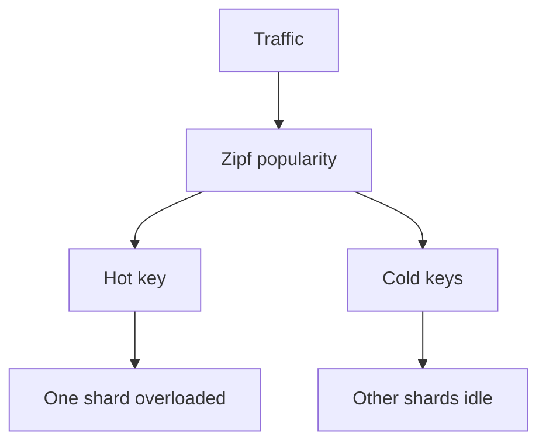

# Day 054: Hot Partitions

Chapter 7 | Hotspot experiment

Generate skewed traffic and observe hotspots.

## Summary

Even with balanced hash partitioning, skewed access patterns can overload one shard. Celebrity keys, viral posts, or regional spikes create hotspots that no hash alone fixes. Mitigations include caching, read replicas for hot keys, key salting (splitting one logical key across shards), and dedicated overflow handling.

> These notes and diagrams are original study aids for this repo, not copies of DDIA figures or prose. Read the matching section in your own copy of the book.

## Key points

- Partition balance measures data size; hotspot measures request rate, they differ.
- Zipf-like popularity is common in user-generated content.
- Salting spreads writes but complicates reads (scatter-gather).
- Caching hot keys reduces shard QPS but adds invalidation complexity.
- Detect hotspots with per-partition metrics, not cluster averages.

## Diagram

Skewed popularity concentrates QPS on a single partition.



## Today

1. Read the matching DDIA section in your own copy of the book.
2. Skim [WORKFLOW.md](../WORKFLOW.md) if you need the shared checklist.
3. Run the starter, then do Try this / Break it / Measure.

### Run the starter

```bash
cd workbook/starter
python3 main.py --help
python3 main.py
```

See [workbook/starter/README.md](./workbook/starter/README.md).

### Try this

Drive Zipf/power-law traffic at your partitioner. Identify the hot partition.

### Break it

Add caching or key salting for the hot key. Measure relief and new complexity.

### Measure

QPS per partition; hotspot ratio.

## Done when

- [ ] You can explain the idea simply
- [ ] You ran the starter and captured output
- [ ] You changed one variable or failure mode and noted what happened
- [ ] You wrote one trade-off you would defend in a design review

Workbook: [workbook/exercise.md](./workbook/exercise.md)
