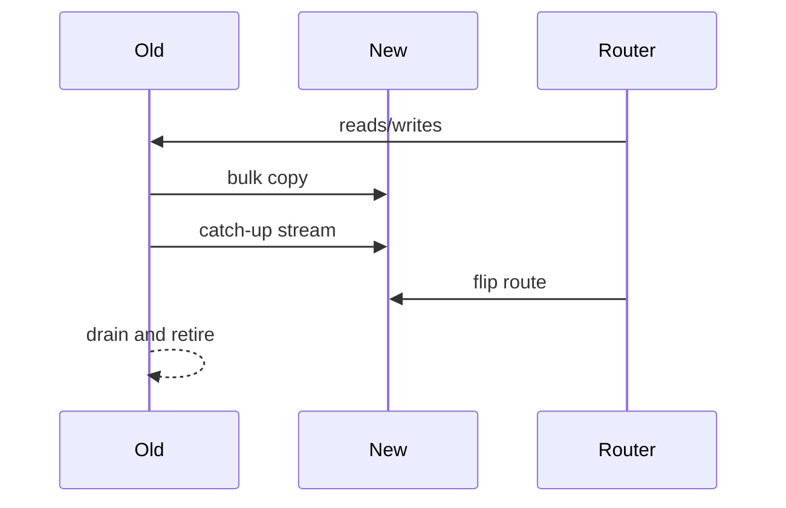

# Day 055: Rebalancing

Chapter 7 | Online rebalance simulation

Move partitions while traffic is still flowing.

## Summary

When you add nodes or partitions grow unevenly, data must move between shards without prolonged downtime. Typical strategies copy a snapshot, catch up on recent writes (dual-write or change log), then flip routing. Failed mid-migration states need explicit abort or rollback to avoid split-brain serving.

> These notes and diagrams are original study aids for this repo, not copies of DDIA figures or prose. Read the matching section in your own copy of the book.

## Key points

- Rebalance = copy data + update routing metadata + drain old location.
- Dual-write or change capture keeps the destination fresh during copy.
- Reads may hit old or new node during migration depending on strategy.
- Abort paths must prevent two writers for the same key range.
- Measure migration throughput and error rate, not only completion time.

## Diagram

Copy, catch up, flip routing, then retire the old shard.



## Today

1. Read the matching DDIA section in your own copy of the book.
2. Skim [WORKFLOW.md](../WORKFLOW.md) if you need the shared checklist.
3. Run the starter, then do Try this / Break it / Measure.

### Run the starter

```bash
cd workbook/starter
python3 main.py --help
python3 main.py
```

See [workbook/starter/README.md](./workbook/starter/README.md).

### Try this

Migrate one partition to a new node with a dual-write or copy+catch-up approach. Keep serving reads.

### Break it

Fail the migration halfway. Can you abort cleanly without split brain?

### Measure

Migration duration and error rate during move.

## Done when

- [ ] You can explain the idea simply
- [ ] You ran the starter and captured output
- [ ] You changed one variable or failure mode and noted what happened
- [ ] You wrote one trade-off you would defend in a design review

Workbook: [workbook/exercise.md](./workbook/exercise.md)
