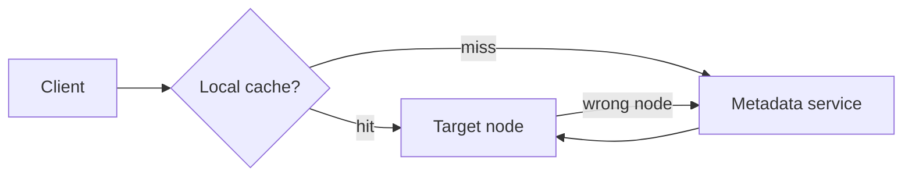

# Day 056: Request Routing

Chapter 7 | Routing lab

Route with metadata and handle stale routing info.

## Summary

Clients need to find which node owns a key. A routing tier (coordinator, gossip, or client-side cache) maps partition -> node. After rebalancing, cached routes go stale; systems use versioned metadata, redirects, or retry-on-wrong-node patterns.

> These notes and diagrams are original study aids for this repo, not copies of DDIA figures or prose. Read the matching section in your own copy of the book.

## Key points

- Routing table: partition_id -> host:port (often versioned).
- Client-side caches reduce lookup load but stale quickly after moves.
- Stale route symptoms: wrong-node errors, higher latency, partial failures.
- Coordinators centralize routing; smart clients reduce hop count.
- Health checks and metadata refresh are part of routing correctness.

## Diagram

Lookup partition ownership; stale cache sends requests to the wrong node.



## Today

1. Read the matching DDIA section in your own copy of the book.
2. Skim [WORKFLOW.md](../WORKFLOW.md) if you need the shared checklist.
3. Run the starter, then do Try this / Break it / Measure.

### Run the starter

```bash
cd workbook/starter
python3 main.py --help
python3 main.py
```

See [workbook/starter/README.md](./workbook/starter/README.md).

### Try this

Client asks a coordinator/lookup for partition -> node. Cache the answer. Then move a partition.

### Break it

Serve with a stale route. Detect and refresh (redirect/error).

### Measure

Stale-route errors and time-to-correct.

## Done when

- [ ] You can explain the idea simply
- [ ] You ran the starter and captured output
- [ ] You changed one variable or failure mode and noted what happened
- [ ] You wrote one trade-off you would defend in a design review

Workbook: [workbook/exercise.md](./workbook/exercise.md)
