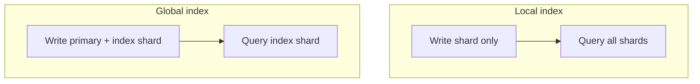

# Day 057: Secondary Indexes on Shards

Chapter 7 | Design comparison

Compare local vs global secondary indexes when data is sharded.

## Summary

Primary sharding picks one key for placement; secondary lookups (email, status) need a different strategy. Local indexes live on each shard (write-local, read scatter-gather). Global indexes route secondary values to a dedicated index shard (write fan-out, read single-hop).

> These notes and diagrams are original study aids for this repo, not copies of DDIA figures or prose. Read the matching section in your own copy of the book.

## Key points

- Local secondary index: cheap writes, expensive multi-shard reads.
- Global secondary index: expensive writes (cross-shard), cheap point lookups.
- Email change on a user may update primary shard + global index entry.
- Scatter-gather reads need merge/sort/limit handling at coordinator.
- Choose index style from read vs write dominance for that access path.

## Diagram

Local indexes write once but read everywhere; global indexes invert the trade-off.



## Today

1. Read the matching DDIA section in your own copy of the book.
2. Skim [WORKFLOW.md](../WORKFLOW.md) if you need the shared checklist.
3. Run the starter, then do Try this / Break it / Measure.

### Run the starter

```bash
cd workbook/starter
python3 main.py --help
python3 main.py
```

See [workbook/starter/README.md](./workbook/starter/README.md).

### Try this

For 'find user by email', design local index (scatter-gather) vs global index. Walk a write and a read for each.

### Break it

Email changes on a user. What updates fan out in the global-index design?

### Measure

Write path fan-out and read fan-out for both.

## Done when

- [ ] You can explain the idea simply
- [ ] You ran the starter and captured output
- [ ] You changed one variable or failure mode and noted what happened
- [ ] You wrote one trade-off you would defend in a design review

Workbook: [workbook/exercise.md](./workbook/exercise.md)
