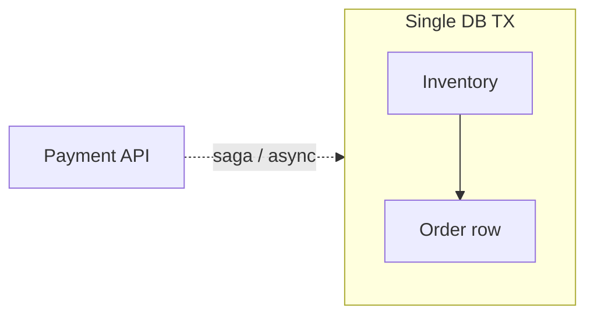

# Day 058: Transaction Boundaries

Chapter 8 | Transaction map

Decide what must sit inside one transaction, and what must not.

## Summary

A transaction groups steps that must succeed or fail together within one database. Distributed checkout spans inventory, payments, and orders, often different services or shards. Drawing boundaries clarifies which invariants are atomic and where sagas/compensation handle cross-service gaps.

> These notes and diagrams are original study aids for this repo, not copies of DDIA figures or prose. Read the matching section in your own copy of the book.

## Key points

- One DB transaction = atomic commit/rollback for touched rows in that DB.
- Cross-service steps need sagas, outbox, or two-phase commit, not one SQL BEGIN.
- Long-held transactions block others; keep boundaries short.
- Idempotent downstream steps simplify partial-failure recovery.
- List invariants first, then place enforcement at the narrowest boundary that works.

## Diagram

Payment sits outside the DB transaction unless you use distributed commit.



## Today

1. Read the matching DDIA section in your own copy of the book.
2. Skim [WORKFLOW.md](../WORKFLOW.md) if you need the shared checklist.
3. Run the starter, then do Try this / Break it / Measure.

### Run the starter

```bash
cd workbook/starter
python3 main.py --help
python3 main.py
```

See [workbook/starter/README.md](./workbook/starter/README.md).

### Try this

For checkout: inventory decrement, payment charge, order insert. Mark transaction boundaries and cross-service gaps.

### Break it

Put payment and inventory in one DB transaction vs saga. What failure looks like either way?

### Measure

Invariants that must never break, and where you enforce them.

## Done when

- [ ] You can explain the idea simply
- [ ] You ran the starter and captured output
- [ ] You changed one variable or failure mode and noted what happened
- [ ] You wrote one trade-off you would defend in a design review

Workbook: [workbook/exercise.md](./workbook/exercise.md)
