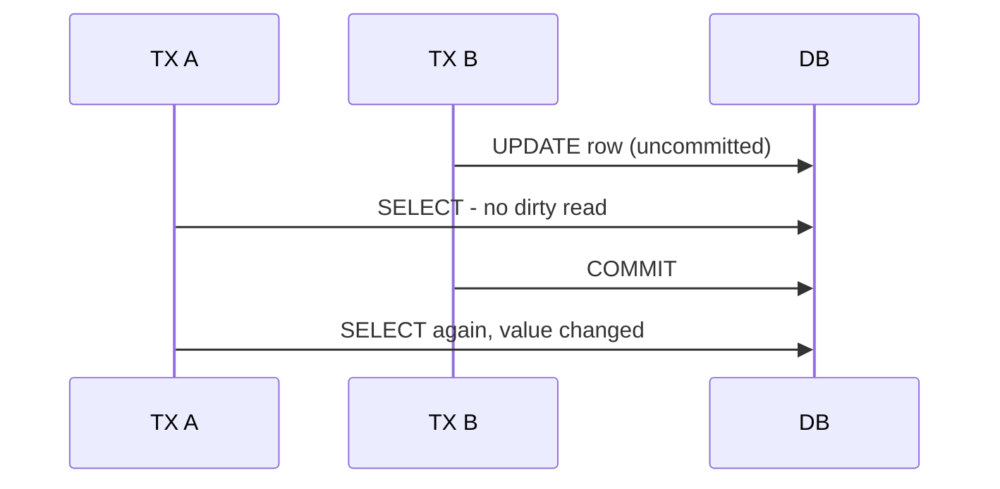

# Day 060: Read Committed

Chapter 8 | PostgreSQL lab

Reproduce dirty and non-repeatable read boundaries in Postgres.

## Summary

Read Committed is the default isolation in many databases: each statement sees only committed data at read time. Dirty reads are prevented, you never see another transaction's uncommitted writes. Non-repeatable reads are allowed, the same row can change between two reads in one transaction.

> These notes and diagrams are original study aids for this repo, not copies of DDIA figures or prose. Read the matching section in your own copy of the book.

## Key points

- No dirty reads: uncommitted changes are invisible to others.
- Each SELECT sees a fresh snapshot of committed data.
- Non-repeatable read: row changes between reads in same TX.
- Phantom reads possible: new matching rows appear between reads.
- Weaker than Repeatable Read / Snapshot Isolation.

## Diagram

Read Committed blocks dirty reads but allows non-repeatable reads.



## Today

1. Read the matching DDIA section in your own copy of the book.
2. Skim [WORKFLOW.md](../WORKFLOW.md) if you need the shared checklist.
3. Run the starter, then do Try this / Break it / Measure.

### Run the starter

```bash
cd workbook/starter
python3 main.py --help
python3 main.py
```

See [workbook/starter/README.md](./workbook/starter/README.md).

### Try this

Two sessions: try to read uncommitted data; then commit and re-read. Use READ COMMITTED.

### Break it

Hold an open transaction that updates a row; show what others see mid-flight.

### Measure

Exact SQL + observed rows for each step.

## Done when

- [ ] You can explain the idea simply
- [ ] You ran the starter and captured output
- [ ] You changed one variable or failure mode and noted what happened
- [ ] You wrote one trade-off you would defend in a design review

Workbook: [workbook/exercise.md](./workbook/exercise.md)
