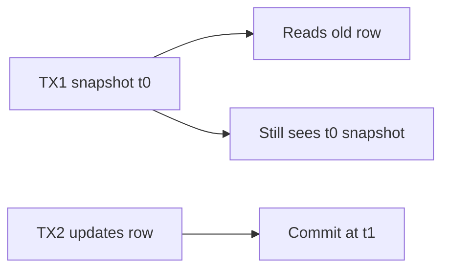

# Day 061: Snapshot Isolation

Chapter 8 | Isolation lab

Watch concurrent snapshots and visibility rules.

## Summary

Snapshot Isolation (SI) gives each transaction a consistent view of the database as of its start time. Readers do not block writers; writers do not block readers. Write-write conflicts on the same row are detected at commit time, one transaction must abort and retry.

> These notes and diagrams are original study aids for this repo, not copies of DDIA figures or prose. Read the matching section in your own copy of the book.

## Key points

- Each transaction reads from a fixed snapshot taken at start.
- First-committer-wins on conflicting row updates.
- Prevents dirty and non-repeatable reads within the snapshot.
- Write skew and some phantoms may still occur under SI.
- SQLite and Postgres RR implement variants of multi-version snapshot reads.

## Diagram

Each transaction reads from its start snapshot; conflicting writes abort at commit.



## Today

1. Read the matching DDIA section in your own copy of the book.
2. Skim [WORKFLOW.md](../WORKFLOW.md) if you need the shared checklist.
3. Run the starter, then do Try this / Break it / Measure.

### Run the starter

```bash
cd workbook/starter
python3 main.py --help
python3 main.py
```

See [workbook/starter/README.md](./workbook/starter/README.md).

### Try this

In Postgres, begin two transactions; write in one; read in the other under repeatable read / SI. Note versions seen.

### Break it

Try a write-write conflict and capture the error.

### Measure

Visibility table: who sees what at each step.

## Done when

- [ ] You can explain the idea simply
- [ ] You ran the starter and captured output
- [ ] You changed one variable or failure mode and noted what happened
- [ ] You wrote one trade-off you would defend in a design review

Workbook: [workbook/exercise.md](./workbook/exercise.md)
