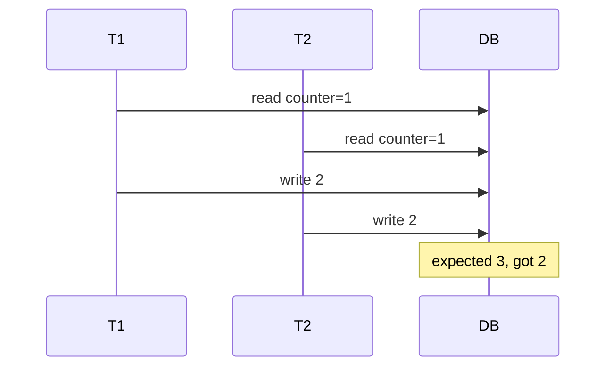

# Day 062: Lost Updates

Chapter 8 | Concurrency test

Reproduce a lost update and fix it.

## Summary

Lost update happens when two transactions read the same value, compute new values independently, and the last writer wins, silently dropping the first increment. Classic fix: atomic single-statement UPDATE (read-modify-write inside DB) or explicit row locking (SELECT FOR UPDATE).

> These notes and diagrams are original study aids for this repo, not copies of DDIA figures or prose. Read the matching section in your own copy of the book.

## Key points

- Read-modify-write races lose increments without coordination.
- Atomic UPDATE x=x+1 avoids lost updates for counters.
- Optimistic locking uses version columns to detect stale writes.
- Retries are required after conflict detection under load.
- Application-level read-then-write is the usual bug source.

## Diagram

Two read-modify-write cycles overwrite each other; atomic updates fix it.



## Today

1. Read the matching DDIA section in your own copy of the book.
2. Skim [WORKFLOW.md](../WORKFLOW.md) if you need the shared checklist.
3. Run the starter, then do Try this / Break it / Measure.

### Run the starter

```bash
cd workbook/starter
python3 main.py --help
python3 main.py
```

See [workbook/starter/README.md](./workbook/starter/README.md).

### Try this

Two transactions read a counter, increment, write back. Show a lost update. Fix with atomic UPDATE or locking.

### Break it

Retry the race under load; confirm the bug is gone.

### Measure

Final counter vs expected; failure rate before/after.

## Done when

- [ ] You can explain the idea simply
- [ ] You ran the starter and captured output
- [ ] You changed one variable or failure mode and noted what happened
- [ ] You wrote one trade-off you would defend in a design review

Workbook: [workbook/exercise.md](./workbook/exercise.md)
