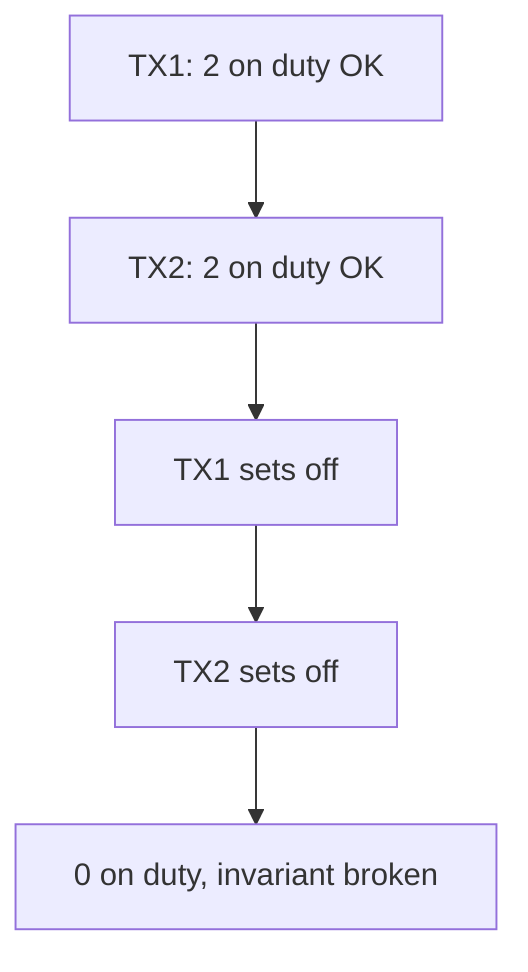

# Day 063: Write Skew

Chapter 8 | Concurrency test

Reproduce write skew under snapshot isolation.

## Summary

Write skew occurs when two transactions read overlapping state, each validates a condition that was true at read time, and both commit changes that together violate an invariant, without touching the same row. Classic example: two on-call doctors both see one person on duty and both go off, leaving zero.

> These notes and diagrams are original study aids for this repo, not copies of DDIA figures or prose. Read the matching section in your own copy of the book.

## Key points

- No single row conflict, but combined writes break an invariant.
- Snapshot isolation may allow both commits unless extra locking/constraints.
- Fix with materialized conflict rows, constraints, or serializable isolation.
- Predicate locks (conceptually) lock the condition, not only rows read.
- Common in shift scheduling, seat booking, quota enforcement.

## Diagram

Both transactions pass checks on stale snapshots; together they violate policy.



## Today

1. Read the matching DDIA section in your own copy of the book.
2. Skim [WORKFLOW.md](../WORKFLOW.md) if you need the shared checklist.
3. Run the starter, then do Try this / Break it / Measure.

### Run the starter

```bash
cd workbook/starter
python3 main.py --help
python3 main.py
```

See [workbook/starter/README.md](./workbook/starter/README.md).

### Try this

Classic doctors-on-call or similar: two transactions each think one remains on duty. Demonstrate skew under SI.

### Break it

Fix with explicit locking, constraints, or serializable. Re-test.

### Measure

Whether the invariant holds under concurrency.

## Done when

- [ ] You can explain the idea simply
- [ ] You ran the starter and captured output
- [ ] You changed one variable or failure mode and noted what happened
- [ ] You wrote one trade-off you would defend in a design review

Workbook: [workbook/exercise.md](./workbook/exercise.md)
