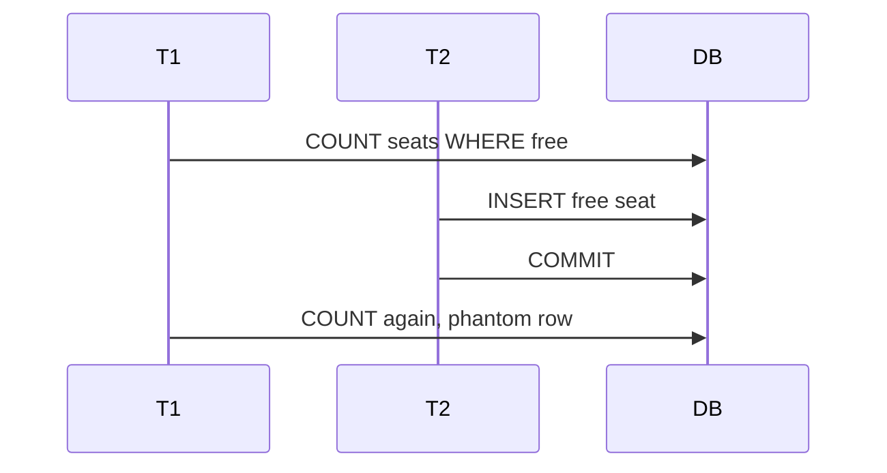

# Day 064: Phantoms

Chapter 8 | SQL experiment

Show predicate anomalies and what stronger isolation changes.

## Summary

A phantom read happens when a transaction repeats a query with a search condition and gets a different row set because another transaction inserted or deleted matching rows. Snapshot isolation prevents some phantoms but not all predicate-dependent anomalies. Serializable isolation or predicate locking closes the gap at higher concurrency cost.

> These notes and diagrams are original study aids for this repo, not copies of DDIA figures or prose. Read the matching section in your own copy of the book.

## Key points

- Phantom = new rows match an earlier predicate search.
- Differs from non-repeatable read (same row changed).
- Index-range locks or serializable schedulers prevent phantoms.
- Reporting queries in long transactions are phantom-sensitive.
- Materializing predicates (counter rows) is a practical workaround.

## Diagram

A second COUNT sees rows that were not there at the first COUNT.



## Today

1. Read the matching DDIA section in your own copy of the book.
2. Skim [WORKFLOW.md](../WORKFLOW.md) if you need the shared checklist.
3. Run the starter, then do Try this / Break it / Measure.

### Run the starter

```bash
cd workbook/starter
python3 main.py --help
python3 main.py
```

See [workbook/starter/README.md](./workbook/starter/README.md).

### Try this

Transaction counts rows matching a predicate; another inserts a matching row; first re-reads. Observe phantoms.

### Break it

Raise isolation / use locking so the phantom cannot appear. Note the cost.

### Measure

Counts before/after and isolation level used.

## Done when

- [ ] You can explain the idea simply
- [ ] You ran the starter and captured output
- [ ] You changed one variable or failure mode and noted what happened
- [ ] You wrote one trade-off you would defend in a design review

Workbook: [workbook/exercise.md](./workbook/exercise.md)
