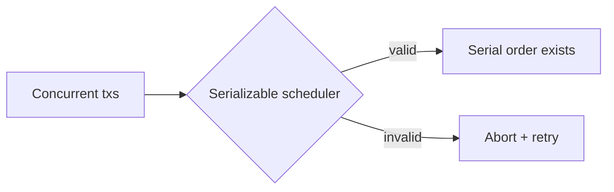

# Day 065: Serializability

Chapter 8 | Benchmark

Compare serial execution with concurrent serializable transactions.

## Summary

Serializable isolation guarantees an outcome equivalent to some serial order of transactions, no lost updates, write skew, or phantoms. Implementations use strict two-phase locking or optimistic serializable validation (SSI). Correctness improves; throughput may drop due to aborts, locks, and retries.

> These notes and diagrams are original study aids for this repo, not copies of DDIA figures or prose. Read the matching section in your own copy of the book.

## Key points

- Serializable = equivalent to running transactions one-at-a-time.
- SSI detects dangerous structures and aborts at commit.
- Abort/retry storms appear under high contention.
- Weaker levels trade anomalies for throughput.
- Pick isolation from invariant requirements, not defaults.

## Diagram

The scheduler accepts only histories equivalent to serial execution.



## Today

1. Read the matching DDIA section in your own copy of the book.
2. Skim [WORKFLOW.md](../WORKFLOW.md) if you need the shared checklist.
3. Run the starter, then do Try this / Break it / Measure.

### Run the starter

```bash
cd workbook/starter
python3 main.py --help
python3 main.py
```

See [workbook/starter/README.md](./workbook/starter/README.md).

### Try this

Run the write-skew workload under SI vs SERIALIZABLE (or serial queue). Compare correctness and throughput.

### Break it

Under SERIALIZABLE, force aborts; measure retry overhead.

### Measure

abort rate and throughput.

## Done when

- [ ] You can explain the idea simply
- [ ] You ran the starter and captured output
- [ ] You changed one variable or failure mode and noted what happened
- [ ] You wrote one trade-off you would defend in a design review

Workbook: [workbook/exercise.md](./workbook/exercise.md)
