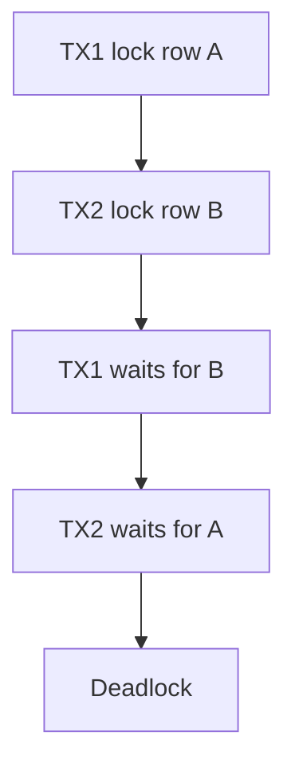

# Day 066: Two-Phase Locking

Chapter 8 | Locking lab

Watch lock acquisition and deadlocks.

## Summary

Strict two-phase locking (2PL) acquires locks before accessing data and holds all locks until commit/abort. This prevents many isolation anomalies but introduces blocking and deadlocks when transactions lock resources in different orders. Imposing a global lock ordering convention eliminates deadlocks at the cost of design discipline.

> These notes and diagrams are original study aids for this repo, not copies of DDIA figures or prose. Read the matching section in your own copy of the book.

## Key points

- Growing phase: acquire locks; shrinking phase: release at end.
- Row/table locks serialize conflicting accesses.
- Deadlock = circular wait; DB detects and aborts one victim.
- Lock ordering (always lock A before B) prevents cycles.
- Long transactions under 2PL reduce concurrency.

## Diagram

Opposite lock order creates a circular wait.



## Today

1. Read the matching DDIA section in your own copy of the book.
2. Skim [WORKFLOW.md](../WORKFLOW.md) if you need the shared checklist.
3. Run the starter, then do Try this / Break it / Measure.

### Run the starter

```bash
cd workbook/starter
python3 main.py --help
python3 main.py
```

See [workbook/starter/README.md](./workbook/starter/README.md).

### Try this

Two transactions lock rows in opposite order. Capture a deadlock. Inspect lock waits if available.

### Break it

Impose a lock ordering convention. Confirm deadlocks disappear.

### Measure

Deadlock frequency and wait time.

## Done when

- [ ] You can explain the idea simply
- [ ] You ran the starter and captured output
- [ ] You changed one variable or failure mode and noted what happened
- [ ] You wrote one trade-off you would defend in a design review

Workbook: [workbook/exercise.md](./workbook/exercise.md)
