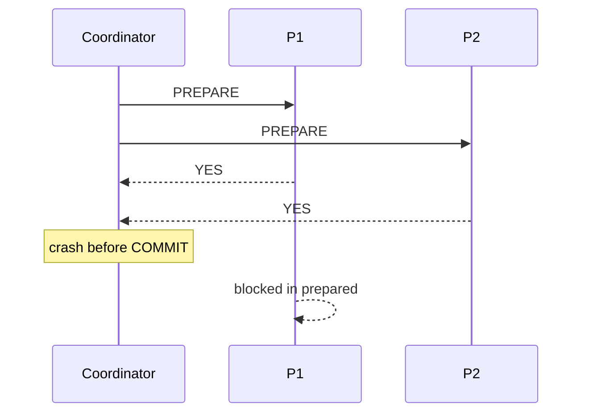

# Day 067: Two-Phase Commit

Chapter 8 | 2PC simulator

Toy coordinator + participants; then kill the coordinator.

## Summary

Two-phase commit coordinates atomic commit across multiple participants: Phase 1 (prepare/vote) then Phase 2 (commit/abort). If all vote YES, coordinator sends COMMIT; otherwise ABORT. Coordinator failure after prepare leaves participants blocked until recovery, classic trade-off of strong atomicity vs availability.

> These notes and diagrams are original study aids for this repo, not copies of DDIA figures or prose. Read the matching section in your own copy of the book.

## Key points

- Prepare: participants persist ready-to-commit state and vote.
- Commit: coordinator decision is durable before telling participants.
- Coordinator crash after prepare -> participants hold locks, wait for decision.
- 3PC and saga patterns address some 2PC availability limits.
- 2PC is for cross-resource atomicity, not everyday single-DB txs.

## Diagram

After unanimous prepare, a coordinator crash stalls participants.



## Today

1. Read the matching DDIA section in your own copy of the book.
2. Skim [WORKFLOW.md](../WORKFLOW.md) if you need the shared checklist.
3. Run the starter, then do Try this / Break it / Measure.

### Run the starter

```bash
cd workbook/starter
python3 main.py --help
python3 main.py
```

See [workbook/starter/README.md](./workbook/starter/README.md).

### Try this

Implement prepare/commit/abort across two resource managers in process. Persist votes.

### Break it

Crash the coordinator after prepare. Participants are blocked, show it.

### Measure

States of each participant after the crash; recovery strategy.

## Done when

- [ ] You can explain the idea simply
- [ ] You ran the starter and captured output
- [ ] You changed one variable or failure mode and noted what happened
- [ ] You wrote one trade-off you would defend in a design review

Workbook: [workbook/exercise.md](./workbook/exercise.md)
