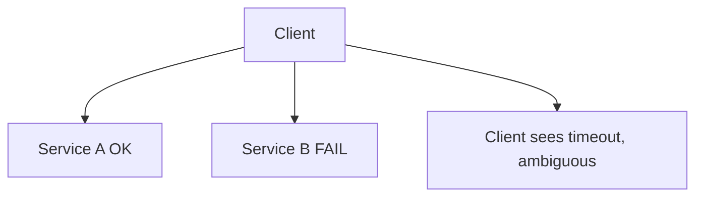

# Day 068: Partial Failure

Chapter 9 | Fault-injection lab

Build something where pieces fail independently.

## Summary

In distributed systems, one component can fail while others succeed, leaving ambiguous overall state. Clients may see timeouts despite server-side success, or success on one shard and failure on another. Design for idempotency, reconciliation, and explicit failure states instead of assuming all-or-nothing RPC.

> These notes and diagrams are original study aids for this repo, not copies of DDIA figures or prose. Read the matching section in your own copy of the book.

## Key points

- Independent failure domains multiply edge cases.
- Dual-write without coordination creates partial success bugs.
- Retries need idempotency keys to avoid duplicate effects.
- Outbox/inbox patterns bridge atomic local write + async send.
- Monitor 'unknown' outcomes, not only success/error rates.

## Diagram

One backend succeeds while another fails; the client cannot tell.



## Today

1. Read the matching DDIA section in your own copy of the book.
2. Skim [WORKFLOW.md](../WORKFLOW.md) if you need the shared checklist.
3. Run the starter, then do Try this / Break it / Measure.

### Run the starter

```bash
cd workbook/starter
python3 main.py --help
python3 main.py
```

See [workbook/starter/README.md](./workbook/starter/README.md).

### Try this

Client talks to two backends. Kill one mid-request. Observe retries, timeouts, and partial success.

### Break it

Make the client assume 'both succeeded' after a timeout. Create a dual-write bug.

### Measure

Outcomes: success, fail, ambiguous, and how you reconcile.

## Done when

- [ ] You can explain the idea simply
- [ ] You ran the starter and captured output
- [ ] You changed one variable or failure mode and noted what happened
- [ ] You wrote one trade-off you would defend in a design review

Workbook: [workbook/exercise.md](./workbook/exercise.md)
