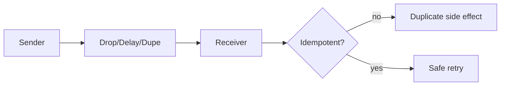

# Day 069: Unreliable Networks

Chapter 9 | Network simulator

Inject latency, drops, duplicates, and reordering.

## Summary

Network links drop packets, delay them, duplicate them, and reorder delivery. TCP masks some issues but not application-level retries. At-least-once delivery combined with non-idempotent handlers creates duplicate side effects. Idempotency keys let servers deduplicate retried requests safely.

> These notes and diagrams are original study aids for this repo, not copies of DDIA figures or prose. Read the matching section in your own copy of the book.

## Key points

- Timeouts trigger retries; retries create duplicates.
- Idempotency keys: same key -> same effect once.
- Message reordering breaks naive state machines.
- Application protocol must assume unreliable transport.
- Exactly-once end-to-end requires dedup + atomic effects.

## Diagram

Unreliable delivery plus retries causes duplicates unless handlers dedupe.



## Today

1. Read the matching DDIA section in your own copy of the book.
2. Skim [WORKFLOW.md](../WORKFLOW.md) if you need the shared checklist.
3. Run the starter, then do Try this / Break it / Measure.

### Run the starter

```bash
cd workbook/starter
python3 main.py --help
python3 main.py
```

See [workbook/starter/README.md](./workbook/starter/README.md).

### Try this

Add a thin proxy or mock transport that delays/drops/duplicates messages between two nodes.

### Break it

Send a non-idempotent operation twice. Fix with idempotency keys.

### Measure

Success rate and duplicate side effects before/after idempotency.

## Done when

- [ ] You can explain the idea simply
- [ ] You ran the starter and captured output
- [ ] You changed one variable or failure mode and noted what happened
- [ ] You wrote one trade-off you would defend in a design review

Workbook: [workbook/exercise.md](./workbook/exercise.md)
