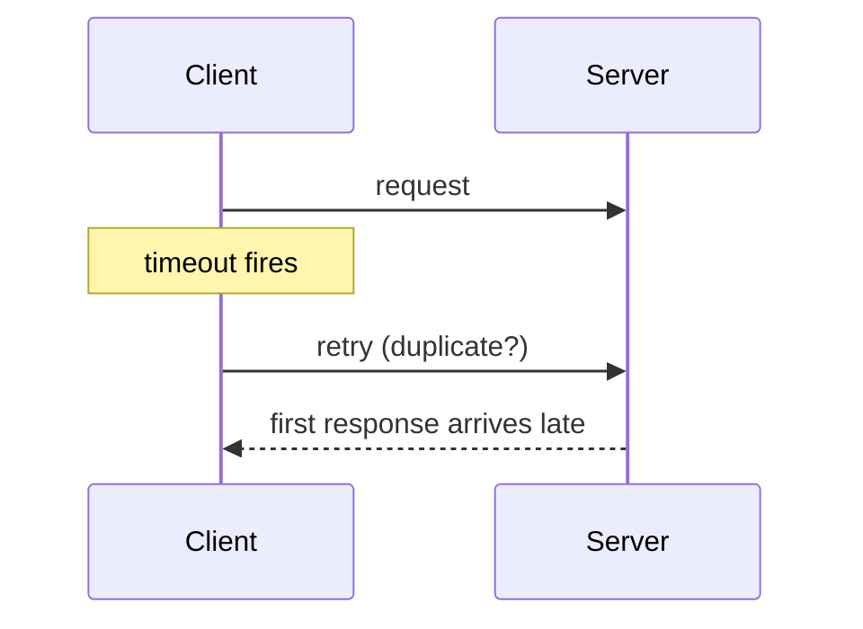

# Day 070: Timeouts

Chapter 9 | Timeout experiment

Show that a timeout is a guess, not proof of failure.

## Summary

A client timeout means 'no response yet', not 'the operation failed'. The server may still complete the request after the client gave up, so blind retries can duplicate work. Tune timeouts from measured latency distributions; track ambiguous outcomes explicitly.

> These notes and diagrams are original study aids for this repo, not copies of DDIA figures or prose. Read the matching section in your own copy of the book.

## Key points

- Timeout = uncertainty, not failure confirmation.
- Late responses after timeout cause duplicate retries.
- Set timeout above p99 latency with margin for GC pauses.
- Aggressive timeouts raise false failure rates under load.
- Idempotency + status queries resolve ambiguity.

## Diagram

Client gives up while the server is still working; retries overlap.



## Today

1. Read the matching DDIA section in your own copy of the book.
2. Skim [WORKFLOW.md](../WORKFLOW.md) if you need the shared checklist.
3. Run the starter, then do Try this / Break it / Measure.

### Run the starter

```bash
cd workbook/starter
python3 main.py --help
python3 main.py
```

See [workbook/starter/README.md](./workbook/starter/README.md).

### Try this

Server sometimes slow, sometimes dead. Client times out and retries. Log cases where the first request still succeeded.

### Break it

Too-aggressive timeout under load. Measure false failure rate.

### Measure

Ambiguous outcomes count; chosen timeout vs p99 latency.

## Done when

- [ ] You can explain the idea simply
- [ ] You ran the starter and captured output
- [ ] You changed one variable or failure mode and noted what happened
- [ ] You wrote one trade-off you would defend in a design review

Workbook: [workbook/exercise.md](./workbook/exercise.md)
