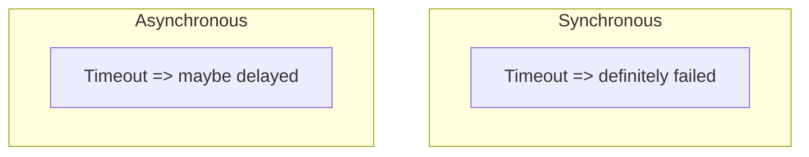

# Day 071: Synchronous vs Asynchronous Models

Chapter 9 | Modeling exercise

Show how timing assumptions change what you can guarantee.

## Summary

Distributed algorithms are proved under timing assumptions: synchronous (bounded delay), asynchronous (no bounds), or partially synchronous (eventually bounded). Leader election, failure detection, and consensus proofs depend on which model you assume. Long pauses violate synchronous assumptions, designs that rely on quick heartbeats break.

> These notes and diagrams are original study aids for this repo, not copies of DDIA figures or prose. Read the matching section in your own copy of the book.

## Key points

- Synchronous model: fixed upper bound on message delay.
- Asynchronous model: no timing guarantees. FLP impossibility applies.
- Partial synchrony: delays are bounded eventually, not always.
- Failure detectors are unreliable in pure async models.
- State assumptions explicitly before trusting guarantees.

## Diagram

Under async assumptions, silence does not prove failure.



## Today

1. Read the matching DDIA section in your own copy of the book.
2. Skim [WORKFLOW.md](../WORKFLOW.md) if you need the shared checklist.
3. Run the starter, then do Try this / Break it / Measure.

### Run the starter

```bash
cd workbook/starter
python3 main.py --help
python3 main.py
```

See [workbook/starter/README.md](./workbook/starter/README.md).

### Try this

Write two designs for leader election: one assuming bounded delay, one that does not. List guarantees each can claim.

### Break it

Violate the synchronous assumption (long pause). Which design lies?

### Measure

Guarantees table under sync vs partial sync vs async.

## Done when

- [ ] You can explain the idea simply
- [ ] You ran the starter and captured output
- [ ] You changed one variable or failure mode and noted what happened
- [ ] You wrote one trade-off you would defend in a design review

Workbook: [workbook/exercise.md](./workbook/exercise.md)
