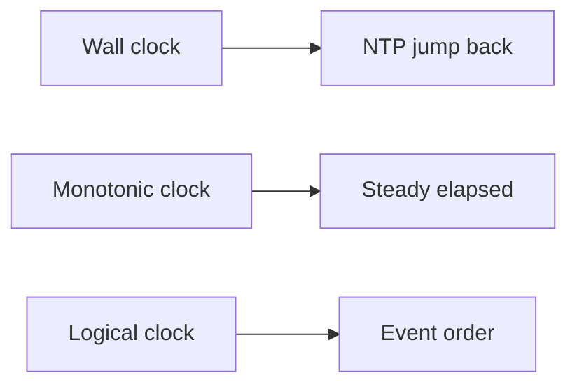

# Day 072: Monotonic and Wall Clocks

Chapter 9 | Clock simulator

Simulate skew and backwards wall-clock jumps.

## Summary

Wall clocks (time-of-day) can jump backward when NTP adjusts system time, they are unsuitable for measuring elapsed time or ordering events across machines. Monotonic clocks count steady ticks and never go backward, but are not comparable across nodes. Logical clocks (Lamport, vector) order events without trusting synchronized wall time.

> These notes and diagrams are original study aids for this repo, not copies of DDIA figures or prose. Read the matching section in your own copy of the book.

## Key points

- time.time() can step backward; time.monotonic() cannot.
- Cross-node ordering needs logical clocks or synchronized time with uncertainty.
- Last-write-wins using wall clocks breaks under skew.
- Monotonic clocks measure duration, not global order.
- Always separate 'when it happened' from 'how long it took'.

## Diagram

Wall time jumps; monotonic time measures elapsed; logical time orders events.



## Today

1. Read the matching DDIA section in your own copy of the book.
2. Skim [WORKFLOW.md](../WORKFLOW.md) if you need the shared checklist.
3. Run the starter, then do Try this / Break it / Measure.

### Run the starter

```bash
cd workbook/starter
python3 main.py --help
python3 main.py
```

See [workbook/starter/README.md](./workbook/starter/README.md).

### Try this

Stamp events with wall clock vs monotonic. Force NTP step-back on wall clock.

### Break it

Order events using wall clock under skew; show incorrect order vs Lamport/monotonic.

### Measure

Mis-order count when relying on wall time.

## Done when

- [ ] You can explain the idea simply
- [ ] You ran the starter and captured output
- [ ] You changed one variable or failure mode and noted what happened
- [ ] You wrote one trade-off you would defend in a design review

Workbook: [workbook/exercise.md](./workbook/exercise.md)
