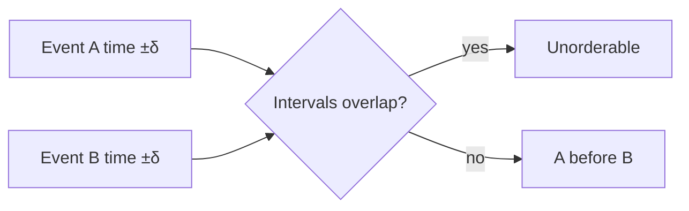

# Day 073: Clock Synchronization

Chapter 9 | Timing experiment

Estimate uncertainty; do not pretend clocks are exact.

## Summary

Synchronized clocks always have error bounds, offset and drift between machines mean timestamps disagree within an uncertainty window. Google's TrueTime exposes explicit uncertainty intervals; Spanner waits out uncertainty before committing. If two timestamps overlap in uncertainty, you cannot say which event happened first.

> These notes and diagrams are original study aids for this repo, not copies of DDIA figures or prose. Read the matching section in your own copy of the book.

## Key points

- Measure offset between machines; don't assume zero skew.
- Uncertainty interval = |clock_offset| + drift_rate × elapsed.
- Compare timestamps only when intervals do not overlap.
- Leap seconds and VM migration worsen clock surprises.
- Design APIs that don't require global precise simultaneity.

## Diagram

Only order events when uncertainty intervals do not overlap.



## Today

1. Read the matching DDIA section in your own copy of the book.
2. Skim [WORKFLOW.md](../WORKFLOW.md) if you need the shared checklist.
3. Run the starter, then do Try this / Break it / Measure.

### Run the starter

```bash
cd workbook/starter
python3 main.py --help
python3 main.py
```

See [workbook/starter/README.md](./workbook/starter/README.md).

### Try this

Measure offset between two machines/processes (or simulate). Define an uncertainty window.

### Break it

Compare timestamps inside the uncertainty window. Refuse to order them.

### Measure

Measured offset and your uncertainty bound.

## Done when

- [ ] You can explain the idea simply
- [ ] You ran the starter and captured output
- [ ] You changed one variable or failure mode and noted what happened
- [ ] You wrote one trade-off you would defend in a design review

Workbook: [workbook/exercise.md](./workbook/exercise.md)
