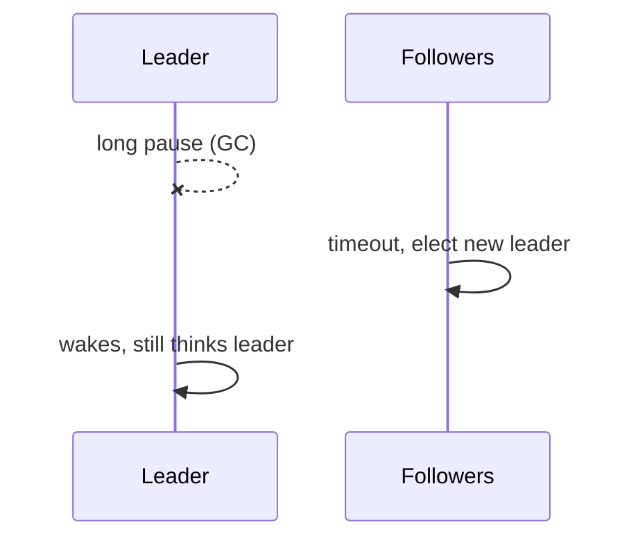

# Day 074: Process Pauses

Chapter 9 | Pause injection

Simulate stop-the-world pauses and stale heartbeats.

## Summary

A process can stop making progress for seconds. GC stop-the-world, hypervisor freeze, long I/O without crashing. Peers using heartbeat timeouts may declare it dead and elect a new leader while the paused node is still alive. When it resumes, two leaders may act concurrently (split brain) unless fencing prevents stale actors.

> These notes and diagrams are original study aids for this repo, not copies of DDIA figures or prose. Read the matching section in your own copy of the book.

## Key points

- Heartbeat timeout != process crash; pauses look like death.
- GC, VM migration, and disk stalls cause surprise pauses.
- False-positive failure detection triggers unnecessary failover.
- Resumed 'dead' nodes must not serve without validation.
- Fencing tokens reject writes from expired leaders.

## Diagram

A paused leader misses heartbeats; followers elect anew; both may write.



## Today

1. Read the matching DDIA section in your own copy of the book.
2. Skim [WORKFLOW.md](../WORKFLOW.md) if you need the shared checklist.
3. Run the starter, then do Try this / Break it / Measure.

### Run the starter

```bash
cd workbook/starter
python3 main.py --help
python3 main.py
```

See [workbook/starter/README.md](./workbook/starter/README.md).

### Try this

Node sends heartbeats; freeze it (sleep/SIGSTOP) without killing it. Watch peers declare it dead while it is 'alive'.

### Break it

Paused node wakes and keeps acting as leader. Create a split-brain moment.

### Measure

False-positive death detections; split-brain duration.

## Done when

- [ ] You can explain the idea simply
- [ ] You ran the starter and captured output
- [ ] You changed one variable or failure mode and noted what happened
- [ ] You wrote one trade-off you would defend in a design review

Workbook: [workbook/exercise.md](./workbook/exercise.md)
