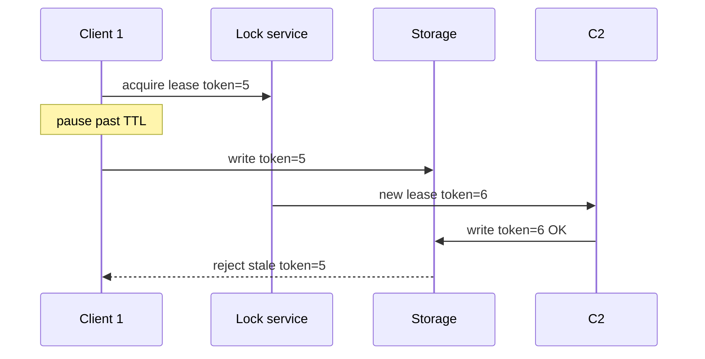

# Day 075: Leases and Locks

Chapter 9 | Lease lab

Design a lease and attack it with pauses and partitions.

## Summary

A lease grants lock ownership for a limited TTL; the holder must renew before expiry. If the holder pauses past TTL, another client can acquire the lease, creating two holders unless writes are fenced. Fencing tokens (monotonically increasing numbers from the lock service) let storage reject stale writers.

> These notes and diagrams are original study aids for this repo, not copies of DDIA figures or prose. Read the matching section in your own copy of the book.

## Key points

- Lease = lock with expiry; renewal assumes timely progress.
- TTL must exceed normal pause but short enough to fail over quickly.
- Stale lease holders after pause are dangerous without fencing.
- Fencing token increments on each new lease grant.
- Storage rejects writes with token older than latest seen.

## Diagram

After lease expiry, only the higher fencing token may write.



## Today

1. Read the matching DDIA section in your own copy of the book.
2. Skim [WORKFLOW.md](../WORKFLOW.md) if you need the shared checklist.
3. Run the starter, then do Try this / Break it / Measure.

### Run the starter

```bash
cd workbook/starter
python3 main.py --help
python3 main.py
```

See [workbook/starter/README.md](./workbook/starter/README.md).

### Try this

Implement a lock with a TTL lease. Renew periodically. Fence tokens on write.

### Break it

Pause the holder past TTL; let a new holder take the lock; old holder resumes writing without a fence.

### Measure

Whether fencing prevents the stale writer's writes.

## Done when

- [ ] You can explain the idea simply
- [ ] You ran the starter and captured output
- [ ] You changed one variable or failure mode and noted what happened
- [ ] You wrote one trade-off you would defend in a design review

Workbook: [workbook/exercise.md](./workbook/exercise.md)
