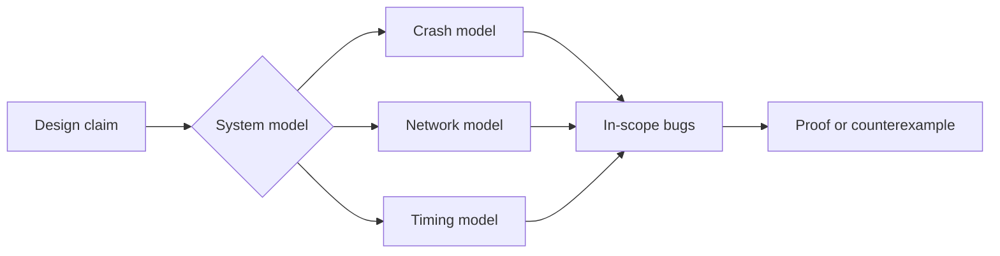

# Day 076: System Models

Chapter 9 | Model specification

State assumptions explicitly; test designs against them.

## Summary

Distributed proofs only hold inside an explicit system model: which nodes can crash, whether the network drops or reorders messages, and whether delays are bounded. Changing one assumption, like allowing arbitrary process pauses, can invalidate safety arguments that looked solid under a friendlier model.

> These notes and diagrams are original study aids for this repo, not copies of DDIA figures or prose. Read the matching section in your own copy of the book.

## Key points

- Crash-stop, crash-recovery, and Byzantine faults imply different algorithms and proofs.
- Synchronous models assume bounded delay; partial synchrony allows long stalls; async models assume none.
- Safety properties should hold in all reachable states; liveness may require timing assumptions.
- Every design review should list in-scope failures and explicitly out-of-scope ones.

## Diagram

Claims are only meaningful relative to an explicit system model.



## Today

1. Read the matching DDIA section in your own copy of the book.
2. Skim [WORKFLOW.md](../WORKFLOW.md) if you need the shared checklist.
3. Run the starter, then do Try this / Break it / Measure.

### Run the starter

```bash
cd workbook/starter
python3 main.py --help
python3 main.py
```

See [workbook/starter/README.md](./workbook/starter/README.md).

### Try this

For your lease/lock design, write the system model: crash/recovery, network, timing. List which bugs are in-scope.

### Break it

Change one assumption (e.g. allow arbitrary pause). Which proofs collapse?

### Measure

Assumption checklist + out-of-scope failures.

## Done when

- [ ] You can explain the idea simply
- [ ] You ran the starter and captured output
- [ ] You changed one variable or failure mode and noted what happened
- [ ] You wrote one trade-off you would defend in a design review

Workbook: [workbook/exercise.md](./workbook/exercise.md)
