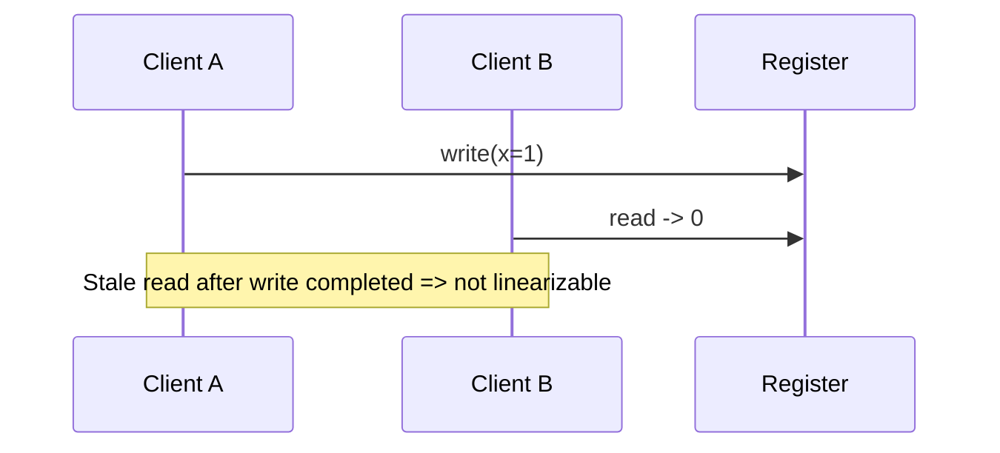

# Day 077: Linearizability

Chapter 10 | History checker

Build operation histories; spot linearizable vs not.

## Summary

Linearizability requires every operation to appear instantaneous at some point between its invocation and response, respecting real-time order. A history checker tests whether a concurrent trace of reads and writes could come from a sequential register that respects those constraints.

> These notes and diagrams are original study aids for this repo, not copies of DDIA figures or prose. Read the matching section in your own copy of the book.

## Key points

- Each op must appear to take effect at a single instant within its interval.
- Real-time precedence: if op A finishes before B starts, A must precede B in the order.
- Stale reads that cross a completed write violate linearizability.
- Checking small histories by hand builds intuition for stronger guarantees.

## Diagram

A read returning an old value after a completed write breaks linearizability.



## Today

1. Read the matching DDIA section in your own copy of the book.
2. Skim [WORKFLOW.md](../WORKFLOW.md) if you need the shared checklist.
3. Run the starter, then do Try this / Break it / Measure.

### Run the starter

```bash
cd workbook/starter
python3 main.py --help
python3 main.py
```

See [workbook/starter/README.md](./workbook/starter/README.md).

### Try this

Record client ops with invoke/ok times for a register. Draw a linearization or show why none exists.

### Break it

Add a stale read that crosses a concurrent write. Fail the checker.

### Measure

Pass/fail on 3 hand-written histories.

## Done when

- [ ] You can explain the idea simply
- [ ] You ran the starter and captured output
- [ ] You changed one variable or failure mode and noted what happened
- [ ] You wrote one trade-off you would defend in a design review

Workbook: [workbook/exercise.md](./workbook/exercise.md)
