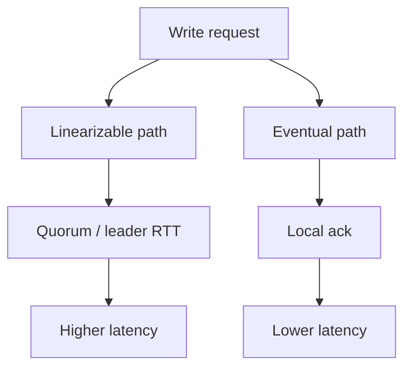

# Day 078: Cost of Linearizability

Chapter 10 | Consistency benchmark

Compare coordination cost with weaker guarantees.

## Summary

Strong consistency usually means waiting for coordination: round-trips to a leader, quorum acks, or lock acquisition. Weaker models trade tail latency and availability during partitions for less cross-node chatter.

> These notes and diagrams are original study aids for this repo, not copies of DDIA figures or prose. Read the matching section in your own copy of the book.

## Key points

- Linearizable writes often need a single coordination point or quorum.
- Eventual consistency can ack locally and reconcile later.
- During partition, linearizable systems may reject ops; weaker ones stay available.
- Measure latency and availability together, not in isolation.

## Diagram

Stronger guarantees typically add coordination on the write path.



## Today

1. Read the matching DDIA section in your own copy of the book.
2. Skim [WORKFLOW.md](../WORKFLOW.md) if you need the shared checklist.
3. Run the starter, then do Try this / Break it / Measure.

### Run the starter

```bash
cd workbook/starter
python3 main.py --help
python3 main.py
```

See [workbook/starter/README.md](./workbook/starter/README.md).

### Try this

Implement a linearizable register (single leader) vs eventually consistent replicas. Measure write latency under delay.

### Break it

Partition the leader. What happens to availability in each model?

### Measure

Latency and availability during partition.

## Done when

- [ ] You can explain the idea simply
- [ ] You ran the starter and captured output
- [ ] You changed one variable or failure mode and noted what happened
- [ ] You wrote one trade-off you would defend in a design review

Workbook: [workbook/exercise.md](./workbook/exercise.md)
