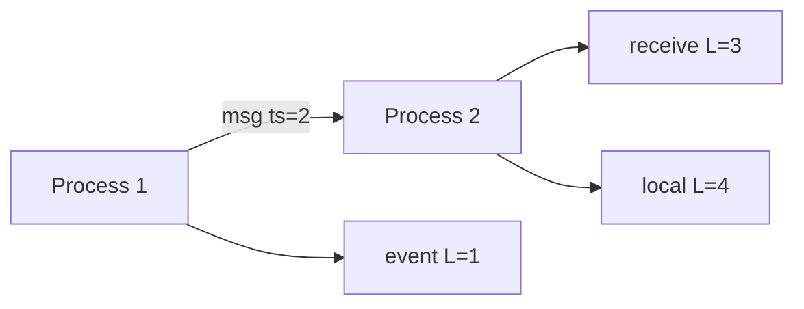

# Day 079: Logical Clocks

Chapter 10 | Clock implementation

Implement Lamport timestamps.

## Summary

Lamport clocks assign monotonically increasing counters so that if event A happened-before B, then L(A) < L(B). Concurrent events may share timestamps, so Lamport order is a partial substitute for wall-clock time.

> These notes and diagrams are original study aids for this repo, not copies of DDIA figures or prose. Read the matching section in your own copy of the book.

## Key points

- Local events increment the counter by one.
- On receive, clock = max(local, message_ts) + 1.
- Happened-before implies timestamp order; the converse is not guaranteed.
- Logical clocks enable ordering without synchronized physical clocks.

## Diagram

Lamport timestamps advance on send, receive, and local events.



## Today

1. Read the matching DDIA section in your own copy of the book.
2. Skim [WORKFLOW.md](../WORKFLOW.md) if you need the shared checklist.
3. Run the starter, then do Try this / Break it / Measure.

### Run the starter

```bash
cd workbook/starter
python3 main.py --help
python3 main.py
```

See [workbook/starter/README.md](./workbook/starter/README.md).

### Try this

Three processes exchange messages; maintain Lamport clocks. Log (event, timestamp).

### Break it

Show two concurrent events with incomparable causal order (same or unrelated stamps, explain).

### Measure

Trace that respects happened-before.

## Done when

- [ ] You can explain the idea simply
- [ ] You ran the starter and captured output
- [ ] You changed one variable or failure mode and noted what happened
- [ ] You wrote one trade-off you would defend in a design review

Workbook: [workbook/exercise.md](./workbook/exercise.md)
