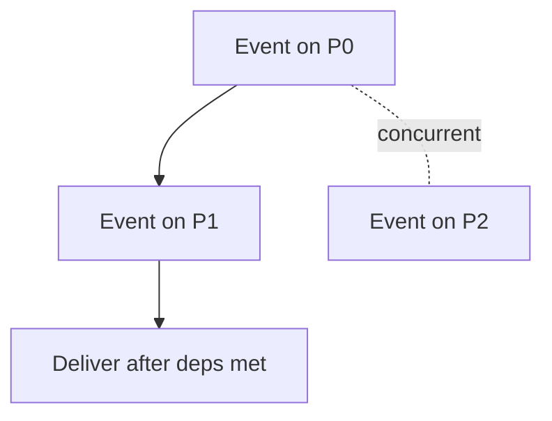

# Day 080: Ordering

Chapter 10 | Event-ordering lab

Use logical time to order concurrent events.

## Summary

Vector clocks track per-process counters and detect causal precedence versus concurrency. If neither vector dominates the other, events are concurrent; delivery protocols can buffer until dependencies are satisfied.

> These notes and diagrams are original study aids for this repo, not copies of DDIA figures or prose. Read the matching section in your own copy of the book.

## Key points

- Vector clock V dominates W if every component V[i] >= W[i] and at least one strict.
- Concurrent vectors mean neither happened-before the other.
- Causal broadcast delays delivery until all predecessors arrive.
- Vector clocks cost O(processes) space per event.

## Diagram

Vector clocks distinguish causal order from concurrency.



## Today

1. Read the matching DDIA section in your own copy of the book.
2. Skim [WORKFLOW.md](../WORKFLOW.md) if you need the shared checklist.
3. Run the starter, then do Try this / Break it / Measure.

### Run the starter

```bash
cd workbook/starter
python3 main.py --help
python3 main.py
```

See [workbook/starter/README.md](./workbook/starter/README.md).

### Try this

Build a simple causal broadcast or ordered log using Lamport/vector clocks.

### Break it

Deliver a message out of causal order on purpose; detect the violation.

### Measure

Whether consumers can see causally inconsistent state.

## Done when

- [ ] You can explain the idea simply
- [ ] You ran the starter and captured output
- [ ] You changed one variable or failure mode and noted what happened
- [ ] You wrote one trade-off you would defend in a design review

Workbook: [workbook/exercise.md](./workbook/exercise.md)
