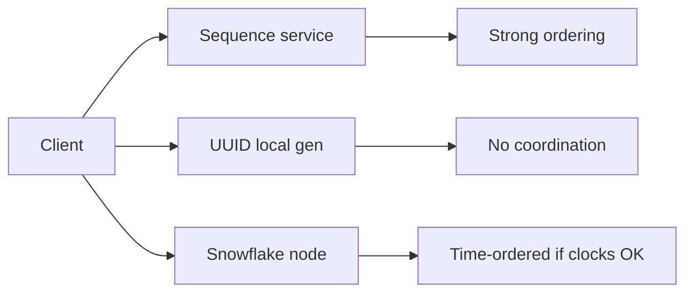

# Day 081: Linearizable IDs

Chapter 10 | Service design

Design an ID service and name its consistency needs.

## Summary

Unique ID generators balance ordering, coordination cost, and fault tolerance. Database sequences are simple but centralized; UUIDs need no coordination but are not time-sortable; Snowflake-style IDs embed time and node bits but assume roughly synchronized clocks.

> These notes and diagrams are original study aids for this repo, not copies of DDIA figures or prose. Read the matching section in your own copy of the book.

## Key points

- Uniqueness may require coordination or probabilistic collision bounds.
- Monotonic time-ordered IDs help range scans and debugging.
- Clock skew can make time-based IDs go backwards without safeguards.
- Fencing tokens pair IDs with storage-side rejection of stale writers.

## Diagram

ID schemes trade coordination, ordering, and operational complexity.



## Today

1. Read the matching DDIA section in your own copy of the book.
2. Skim [WORKFLOW.md](../WORKFLOW.md) if you need the shared checklist.
3. Run the starter, then do Try this / Break it / Measure.

### Run the starter

```bash
cd workbook/starter
python3 main.py --help
python3 main.py
```

See [workbook/starter/README.md](./workbook/starter/README.md).

### Try this

Requirements: unique IDs, roughly time-ordered, multi-region. Compare Snowflake-style vs DB sequence vs UUID.

### Break it

Clock skew in Snowflake-style IDs. Can IDs go backwards?

### Measure

Uniqueness proof sketch and ordering guarantees.

## Done when

- [ ] You can explain the idea simply
- [ ] You ran the starter and captured output
- [ ] You changed one variable or failure mode and noted what happened
- [ ] You wrote one trade-off you would defend in a design review

Workbook: [workbook/exercise.md](./workbook/exercise.md)
