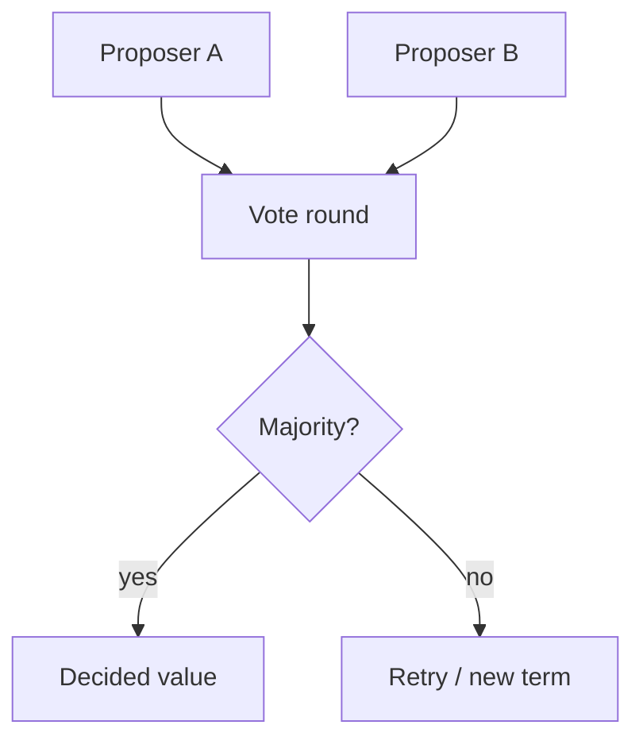

# Day 082: Consensus

Chapter 10 | Consensus simulator

Get concrete about agreement, validity, and termination.

## Summary

Consensus picks a single value among proposals despite failures. Safety means never deciding two different values; validity means the outcome was proposed; liveness means eventually deciding when enough nodes participate.

> These notes and diagrams are original study aids for this repo, not copies of DDIA figures or prose. Read the matching section in your own copy of the book.

## Key points

- Majority quorums overlap, preserving safety across rounds.
- Two competing values in one round require a tie-break or re-vote.
- Losing a minority may still allow progress; losing a quorum blocks decisions.
- Real systems embed consensus in leader election and metadata stores.

## Diagram

Consensus rounds require overlapping majorities to agree safely.



## Today

1. Read the matching DDIA section in your own copy of the book.
2. Skim [WORKFLOW.md](../WORKFLOW.md) if you need the shared checklist.
3. Run the starter, then do Try this / Break it / Measure.

### Run the starter

```bash
cd workbook/starter
python3 main.py --help
python3 main.py
```

See [workbook/starter/README.md](./workbook/starter/README.md).

### Try this

Simulate 3 nodes proposing values; majority wins. Walk a round where two values compete.

### Break it

Lose one node permanently. Can you still decide? Lose quorum?

### Measure

Which safety property holds when you break liveness.

## Done when

- [ ] You can explain the idea simply
- [ ] You ran the starter and captured output
- [ ] You changed one variable or failure mode and noted what happened
- [ ] You wrote one trade-off you would defend in a design review

Workbook: [workbook/exercise.md](./workbook/exercise.md)
