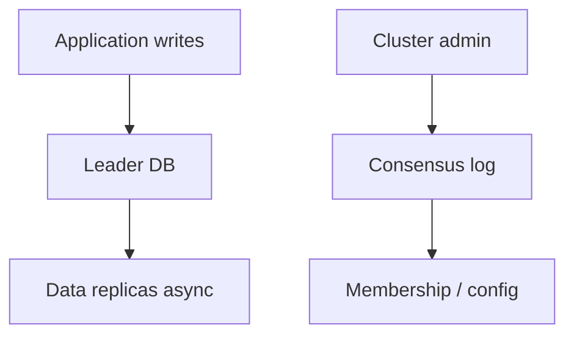

# Day 083: Consensus in Practice

Chapter 10 | Architecture review

Decide where coordination belongs, and where it is waste.

## Summary

Not every write needs Paxos. Reserve consensus for cluster metadata, leader election, and membership changes. Application data paths often tolerate leader-follower replication or partition-tolerant weaker consistency.

> These notes and diagrams are original study aids for this repo, not copies of DDIA figures or prose. Read the matching section in your own copy of the book.

## Key points

- Coordination on the hot path adds latency and availability coupling.
- Config and shard maps are small, rare, and worth strong agreement.
- Misplaced consensus becomes a throughput bottleneck.
- Diagram every coordination point and justify its consistency need.

## Diagram

Consensus suits rare control-plane changes more than bulk data paths.



## Today

1. Read the matching DDIA section in your own copy of the book.
2. Skim [WORKFLOW.md](../WORKFLOW.md) if you need the shared checklist.
3. Run the starter, then do Try this / Break it / Measure.

### Run the starter

```bash
cd workbook/starter
python3 main.py --help
python3 main.py
```

See [workbook/starter/README.md](./workbook/starter/README.md).

### Try this

For a multi-region app, list decisions that need consensus (config, leader) vs those that need only replication.

### Break it

Put consensus on the application write path. Quantify the latency/availability hit.

### Measure

Coordination points diagram with justification.

## Done when

- [ ] You can explain the idea simply
- [ ] You ran the starter and captured output
- [ ] You changed one variable or failure mode and noted what happened
- [ ] You wrote one trade-off you would defend in a design review

Workbook: [workbook/exercise.md](./workbook/exercise.md)
