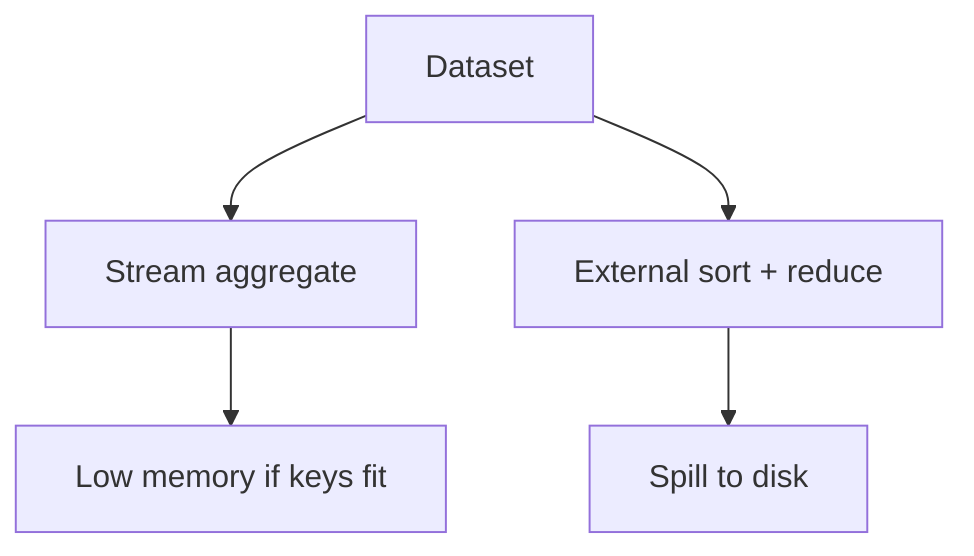

# Day 085: Sorting and Aggregation

Chapter 11 | Benchmark

Compare streaming aggregation with external sort.

## Summary

Streaming aggregators use bounded memory if keys fit in RAM; external sort spills to disk when data exceeds memory. High-cardinality keys explode hash tables; sort-merge approaches trade disk I/O for predictable memory.

> These notes and diagrams are original study aids for this repo, not copies of DDIA figures or prose. Read the matching section in your own copy of the book.

## Key points

- Streaming counts work when key cardinality fits memory.
- External sort handles datasets larger than RAM at I/O cost.
- Skewed key distributions create hot partitions in both approaches.
- Measure peak memory, not only wall time.

## Diagram

Choose streaming vs sort based on memory limits and key cardinality.



## Today

1. Read the matching DDIA section in your own copy of the book.
2. Skim [WORKFLOW.md](../WORKFLOW.md) if you need the shared checklist.
3. Run the starter, then do Try this / Break it / Measure.

### Run the starter

```bash
cd workbook/starter
python3 main.py --help
python3 main.py
```

See [workbook/starter/README.md](./workbook/starter/README.md).

### Try this

Aggregate counts while streaming vs sort-then-count for a dataset larger than memory (simulate with small RAM limit).

### Break it

Force a keycardinal explosion. Which approach dies first?

### Measure

Time and peak memory.

## Done when

- [ ] You can explain the idea simply
- [ ] You ran the starter and captured output
- [ ] You changed one variable or failure mode and noted what happened
- [ ] You wrote one trade-off you would defend in a design review

Workbook: [workbook/exercise.md](./workbook/exercise.md)
