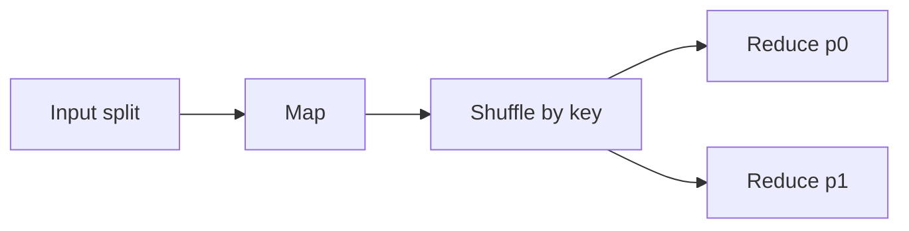

# Day 086: MapReduce

Chapter 11 | Mini MapReduce

Implement map -> shuffle -> reduce locally.

## Summary

MapReduce splits work into parallel map tasks, shuffles intermediate key-value pairs by hash partition, then reduces each partition independently. Deterministic map/reduce functions make retries safe when a worker fails mid-job.

> These notes and diagrams are original study aids for this repo, not copies of DDIA figures or prose. Read the matching section in your own copy of the book.

## Key points

- Map emits (key, value) pairs; shuffle groups by key.
- Partition function controls reducer load and skew.
- Failed map tasks rerun from immutable input splits.
- Output is deterministic when reduce is associative/commutative.

## Diagram

MapReduce separates parallel map, shuffle, and partitioned reduce.



## Today

1. Read the matching DDIA section in your own copy of the book.
2. Skim [WORKFLOW.md](../WORKFLOW.md) if you need the shared checklist.
3. Run the starter, then do Try this / Break it / Measure.

### Run the starter

```bash
cd workbook/starter
python3 main.py --help
python3 main.py
```

See [workbook/starter/README.md](./workbook/starter/README.md).

### Try this

Word count (or URL count) with map workers writing partitions, shuffle by key hash, reduce merge.

### Break it

Kill a map worker; rerun only that partition. Confirm final output identical.

### Measure

Task retries and whether output is deterministic.

## Done when

- [ ] You can explain the idea simply
- [ ] You ran the starter and captured output
- [ ] You changed one variable or failure mode and noted what happened
- [ ] You wrote one trade-off you would defend in a design review

Workbook: [workbook/exercise.md](./workbook/exercise.md)
