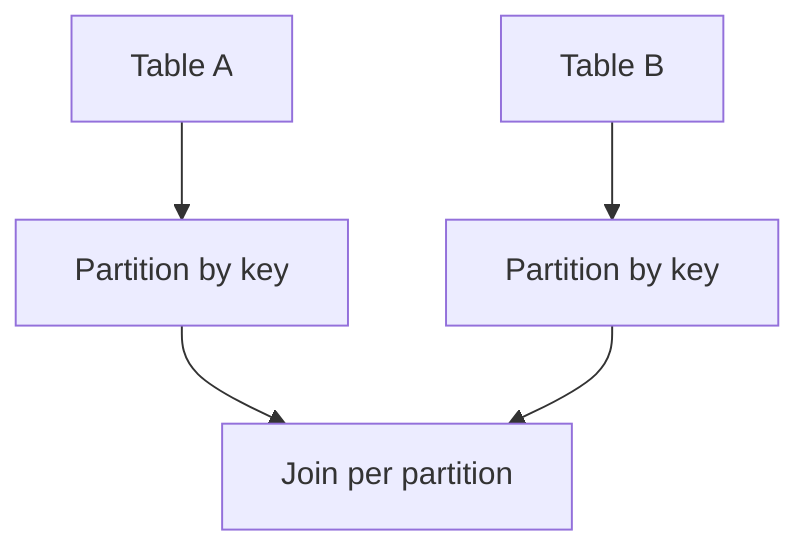

# Day 087: Joins and Grouping

Chapter 11 | Dataflow lab

Implement distributed-style joins and grouping.

## Summary

Partitioned hash joins align both inputs on the same hash of the join key so each reducer handles a slice independently. Skewed keys create hot reducers; salting or two-phase techniques spread the load.

> These notes and diagrams are original study aids for this repo, not copies of DDIA figures or prose. Read the matching section in your own copy of the book.

## Key points

- Both inputs must partition on the same join key function.
- Map-side joins work when one input is small enough to broadcast.
- Skewed keys dominate runtime unless mitigated.
- Grouping is a reduce-side aggregation over shuffled keys.

## Diagram

Hash partitioning aligns join inputs before local merge.



## Today

1. Read the matching DDIA section in your own copy of the book.
2. Skim [WORKFLOW.md](../WORKFLOW.md) if you need the shared checklist.
3. Run the starter, then do Try this / Break it / Measure.

### Run the starter

```bash
cd workbook/starter
python3 main.py --help
python3 main.py
```

See [workbook/starter/README.md](./workbook/starter/README.md).

### Try this

Join clicks and users by user_id via partitioned hash join (partition both inputs the same way).

### Break it

Skewed join key (celebrity user). Show a hot reducer; propose a fix (salted join).

### Measure

Runtime with and without skew mitigation.

## Done when

- [ ] You can explain the idea simply
- [ ] You ran the starter and captured output
- [ ] You changed one variable or failure mode and noted what happened
- [ ] You wrote one trade-off you would defend in a design review

Workbook: [workbook/exercise.md](./workbook/exercise.md)
