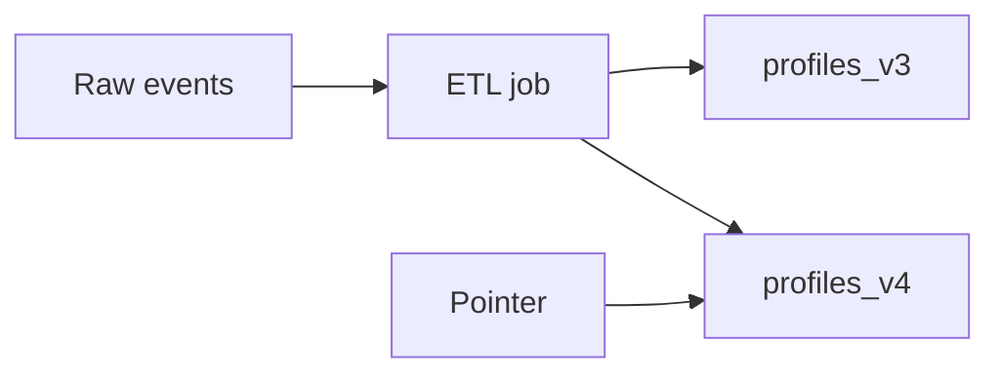

# Day 088: Derived Data

Chapter 11 | ETL pipeline

Batch-build a serving-oriented derived dataset.

## Summary

Derived datasets transform raw events into query-friendly shapes. Versioned output paths let you validate before atomically switching readers to a new snapshot and roll back quickly when a bad deploy corrupts output.

> These notes and diagrams are original study aids for this repo, not copies of DDIA figures or prose. Read the matching section in your own copy of the book.

## Key points

- Raw events remain the source of truth; derived tables are rebuildable.
- Version directories or pointers enable atomic cutover.
- Validation queries gate promotion to production serving.
- Rollback is switching the pointer, not editing rows in place.

## Diagram

Versioned derived outputs enable validate-then-switch deployments.



## Today

1. Read the matching DDIA section in your own copy of the book.
2. Skim [WORKFLOW.md](../WORKFLOW.md) if you need the shared checklist.
3. Run the starter, then do Try this / Break it / Measure.

### Run the starter

```bash
cd workbook/starter
python3 main.py --help
python3 main.py
```

See [workbook/starter/README.md](./workbook/starter/README.md).

### Try this

From raw events, build a daily 'user profile' table/file used by an API. Version the output path.

### Break it

Bad deploy writes corrupt derived data. Roll back by switching a pointer/version.

### Measure

Build time and a validation query on the output.

## Done when

- [ ] You can explain the idea simply
- [ ] You ran the starter and captured output
- [ ] You changed one variable or failure mode and noted what happened
- [ ] You wrote one trade-off you would defend in a design review

Workbook: [workbook/exercise.md](./workbook/exercise.md)
