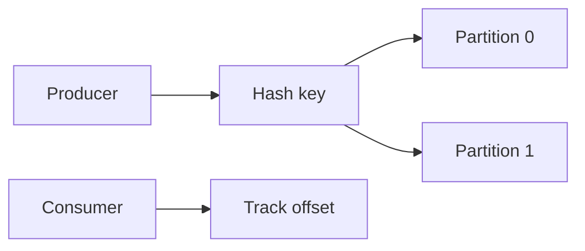

# Day 089: Event Streams

Chapter 12 | Event-log prototype

Build a partitioned append-only event log.

## Summary

Partitioned logs scale by hashing keys to independent append-only segments. Producers append records; consumers track per-partition offsets. Ordering is guaranteed within a partition, not globally across partitions.

> These notes and diagrams are original study aids for this repo, not copies of DDIA figures or prose. Read the matching section in your own copy of the book.

## Key points

- Partition key picks the serial order lane for related events.
- Offsets are monotonic within each partition.
- More partitions raise parallelism but complicate global order.
- Retention and compaction policies differ by use case.

## Diagram

Events with the same key land in one partition for per-key ordering.



## Today

1. Read the matching DDIA section in your own copy of the book.
2. Skim [WORKFLOW.md](../WORKFLOW.md) if you need the shared checklist.
3. Run the starter, then do Try this / Break it / Measure.

### Run the starter

```bash
cd workbook/starter
python3 main.py --help
python3 main.py
```

See [workbook/starter/README.md](./workbook/starter/README.md).

### Try this

Append events to partition files by key hash. Consumers read with an offset.

### Break it

Two producers write the same key. Preserve per-key order within a partition.

### Measure

Throughput and per-partition ordering check.

## Done when

- [ ] You can explain the idea simply
- [ ] You ran the starter and captured output
- [ ] You changed one variable or failure mode and noted what happened
- [ ] You wrote one trade-off you would defend in a design review

Workbook: [workbook/exercise.md](./workbook/exercise.md)
