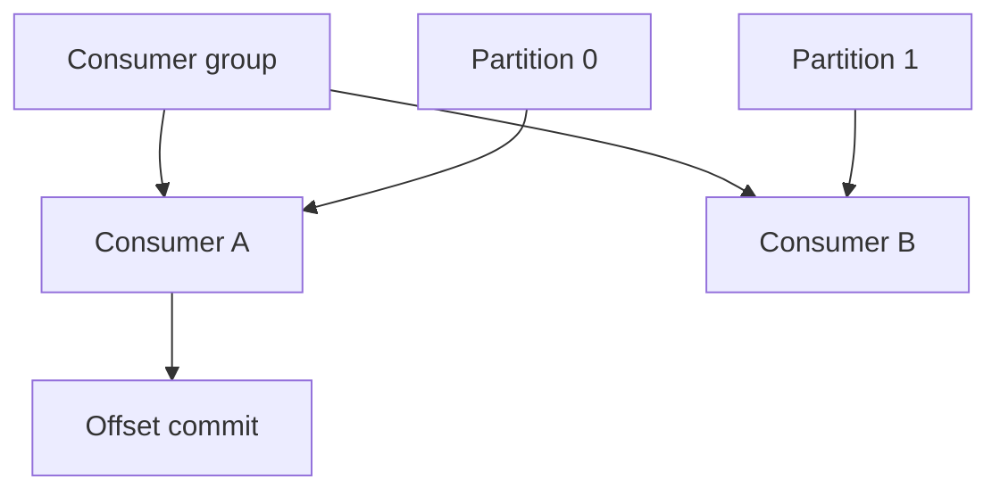

# Day 090: Consumer Groups

Chapter 12 | Consumer-group lab

Assign partitions and track offsets.

## Summary

Consumer groups divide partitions among members for parallel consumption. Rebalance moves assignments when members join or leave. Offset commits define at-least-once vs at-most-once behavior after crashes.

> These notes and diagrams are original study aids for this repo, not copies of DDIA figures or prose. Read the matching section in your own copy of the book.

## Key points

- Each partition is consumed by at most one member in a group.
- Rebalance redistributes partitions on membership change.
- Commit offset after processing for at-least-once delivery.
- Crash before commit causes duplicate processing on restart.

## Diagram

Partitions divide across group members with persisted offsets.



## Today

1. Read the matching DDIA section in your own copy of the book.
2. Skim [WORKFLOW.md](../WORKFLOW.md) if you need the shared checklist.
3. Run the starter, then do Try this / Break it / Measure.

### Run the starter

```bash
cd workbook/starter
python3 main.py --help
python3 main.py
```

See [workbook/starter/README.md](./workbook/starter/README.md).

### Try this

N partitions, M consumers in a group; rebalance when a consumer joins/leaves. Persist offsets.

### Break it

Crash after process but before offset commit. Show at-least-once redelivery.

### Measure

Duplicate processing count; time to rebalance.

## Done when

- [ ] You can explain the idea simply
- [ ] You ran the starter and captured output
- [ ] You changed one variable or failure mode and noted what happened
- [ ] You wrote one trade-off you would defend in a design review

Workbook: [workbook/exercise.md](./workbook/exercise.md)
