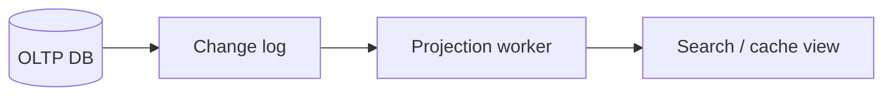

# Day 091: CDC

Chapter 12 | CDC pipeline

Capture DB changes into a derived view.

## Summary

Change data capture turns row-level mutations into an ordered stream consumers apply to projections. Polling on updated_at is simpler but can miss rapid changes; logical logs preserve ordering and delete events.

> These notes and diagrams are original study aids for this repo, not copies of DDIA figures or prose. Read the matching section in your own copy of the book.

## Key points

- Projections converge when every change is applied in log order.
- Deletes must appear explicitly or tombstones are required.
- Multiple rapid updates to one row should end at the latest value.
- Lag between source and projection is normal and measurable.

## Diagram

CDC streams row changes into derived serving views.



## Today

1. Read the matching DDIA section in your own copy of the book.
2. Skim [WORKFLOW.md](../WORKFLOW.md) if you need the shared checklist.
3. Run the starter, then do Try this / Break it / Measure.

### Run the starter

```bash
cd workbook/starter
python3 main.py --help
python3 main.py
```

See [workbook/starter/README.md](./workbook/starter/README.md).

### Try this

Tail a logical log or poll `updated_at` to stream changes into a projection (e.g. search document).

### Break it

Update a row twice quickly. Ensure the projection converges to the latest.

### Measure

Lag and eventual consistency of the projection.

## Done when

- [ ] You can explain the idea simply
- [ ] You ran the starter and captured output
- [ ] You changed one variable or failure mode and noted what happened
- [ ] You wrote one trade-off you would defend in a design review

Workbook: [workbook/exercise.md](./workbook/exercise.md)
