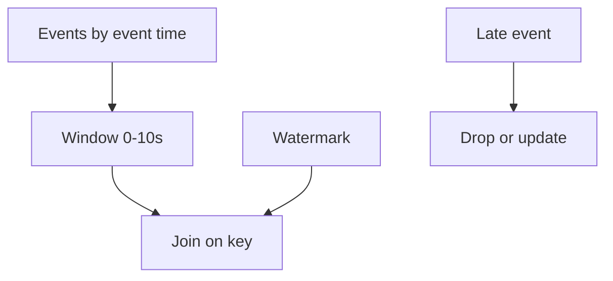

# Day 092: Stream Joins and Time

Chapter 12 | Streaming lab

Window by event time; handle late data.

## Summary

Stream joins correlate events by key inside time windows using event timestamps, not arrival order. Watermarks estimate completeness; late events after the watermark are dropped or trigger retractions depending on policy.

> These notes and diagrams are original study aids for this repo, not copies of DDIA figures or prose. Read the matching section in your own copy of the book.

## Key points

- Event time reflects when something happened; processing time reflects arrival.
- Watermarks trade completeness for lower latency.
- Late events cause wrong joins if ignored silently.
- Side outputs or updates handle stragglers explicitly.

## Diagram

Watermarks bound how long a window waits for late events.



## Today

1. Read the matching DDIA section in your own copy of the book.
2. Skim [WORKFLOW.md](../WORKFLOW.md) if you need the shared checklist.
3. Run the starter, then do Try this / Break it / Measure.

### Run the starter

```bash
cd workbook/starter
python3 main.py --help
python3 main.py
```

See [workbook/starter/README.md](./workbook/starter/README.md).

### Try this

Join clicks and impressions on a time window using event timestamps. Inject late events.

### Break it

Watermark passes; late event arrives. Document drop vs update policy.

### Measure

Late-arrival rate and incorrect join count if ignored.

## Done when

- [ ] You can explain the idea simply
- [ ] You ran the starter and captured output
- [ ] You changed one variable or failure mode and noted what happened
- [ ] You wrote one trade-off you would defend in a design review

Workbook: [workbook/exercise.md](./workbook/exercise.md)
