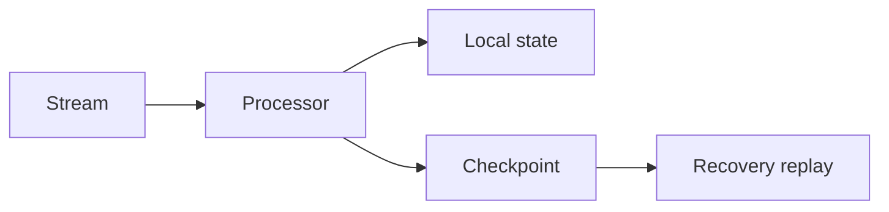

# Day 093: Fault Tolerance in Streams

Chapter 12 | Recovery test

Restart a processor without corrupting derived state.

## Summary

Stateful stream processors checkpoint operator state together with input offsets. On recovery, replay from the checkpointed offset rebuilds the same derived state. Mismatched checkpoint pieces produce silent divergence.

> These notes and diagrams are original study aids for this repo, not copies of DDIA figures or prose. Read the matching section in your own copy of the book.

## Key points

- Checkpoint = offset + operator state atomically.
- Replay from last checkpoint must be deterministic.
- At-least-once processing may need idempotent sinks.
- Separate state and offset checkpoints cause inconsistency.

## Diagram

Checkpoints pair consumed offsets with materialized operator state.



## Today

1. Read the matching DDIA section in your own copy of the book.
2. Skim [WORKFLOW.md](../WORKFLOW.md) if you need the shared checklist.
3. Run the starter, then do Try this / Break it / Measure.

### Run the starter

```bash
cd workbook/starter
python3 main.py --help
python3 main.py
```

See [workbook/starter/README.md](./workbook/starter/README.md).

### Try this

Processor updates local state + output; checkpoint offset+state together. Crash and restore.

### Break it

Checkpoint state without offset (or the reverse). Show inconsistency.

### Measure

Whether replay after crash yields the same derived state.

## Done when

- [ ] You can explain the idea simply
- [ ] You ran the starter and captured output
- [ ] You changed one variable or failure mode and noted what happened
- [ ] You wrote one trade-off you would defend in a design review

Workbook: [workbook/exercise.md](./workbook/exercise.md)
