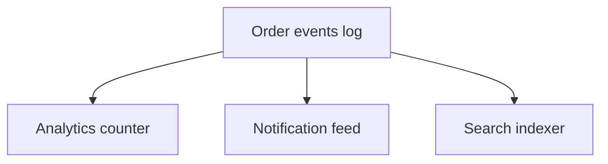

# Day 094: Data Integration

Chapter 13 | Dataflow architecture

Fan one event log out into multiple derived views.

## Summary

A unified log lets independent consumers build specialized views without coupling schemas. Analytics, notifications, and search indexes each subscribe to the same ordered events and evolve on their own deploy cycles.

> These notes and diagrams are original study aids for this repo, not copies of DDIA figures or prose. Read the matching section in your own copy of the book.

## Key points

- One log, many consumers, each owns its derivation logic.
- Schema changes in one consumer do not block others.
- Replay rebuilds any derived view from retained history.
- Operational complexity moves to consumer lag monitoring.

## Diagram

Multiple views derive independently from one append-only log.



## Today

1. Read the matching DDIA section in your own copy of the book.
2. Skim [WORKFLOW.md](../WORKFLOW.md) if you need the shared checklist.
3. Run the starter, then do Try this / Break it / Measure.

### Run the starter

```bash
cd workbook/starter
python3 main.py --help
python3 main.py
```

See [workbook/starter/README.md](./workbook/starter/README.md).

### Try this

From one order-events log, build (a) analytics counts and (b) a customer notification feed. Share the log, not the DB.

### Break it

Rewrite one consumer's schema. Confirm the other is unaffected.

### Measure

Consumer independence: deploy one without touching the other.

## Done when

- [ ] You can explain the idea simply
- [ ] You ran the starter and captured output
- [ ] You changed one variable or failure mode and noted what happened
- [ ] You wrote one trade-off you would defend in a design review

Workbook: [workbook/exercise.md](./workbook/exercise.md)
