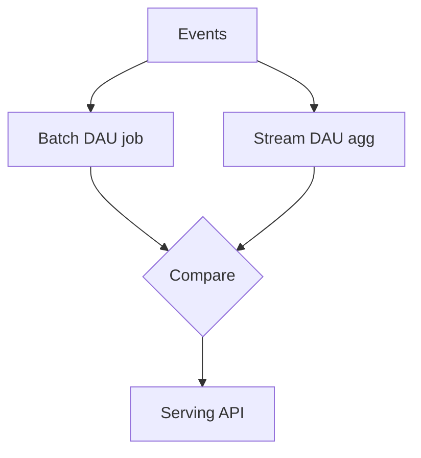

# Day 095: Batch + Stream

Chapter 13 | Dual-pipeline experiment

Same output via batch recompute and incremental stream.

## Summary

Lambda-style architectures run a batch truth path alongside a low-latency stream path. Periodic batch recomputation catches stream bugs and drift; the stream path optimizes freshness for dashboards and alerts.

> These notes and diagrams are original study aids for this repo, not copies of DDIA figures or prose. Read the matching section in your own copy of the book.

## Key points

- Batch recompute from immutable history is the audit baseline.
- Streaming approximates the same metric with lower latency.
- Compare outputs regularly to detect implementation drift.
- Merge serving layers or pick one path per query type.

## Diagram

Dual pipelines cross-check streaming results against batch recomputation.



## Today

1. Read the matching DDIA section in your own copy of the book.
2. Skim [WORKFLOW.md](../WORKFLOW.md) if you need the shared checklist.
3. Run the starter, then do Try this / Break it / Measure.

### Run the starter

```bash
cd workbook/starter
python3 main.py --help
python3 main.py
```

See [workbook/starter/README.md](./workbook/starter/README.md).

### Try this

Compute daily active users with a batch job and with a streaming aggregator. Compare results.

### Break it

Introduce a bug in streaming; use batch as the source of truth to detect drift.

### Measure

Drift between pipelines; time-to-detect.

## Done when

- [ ] You can explain the idea simply
- [ ] You ran the starter and captured output
- [ ] You changed one variable or failure mode and noted what happened
- [ ] You wrote one trade-off you would defend in a design review

Workbook: [workbook/exercise.md](./workbook/exercise.md)
