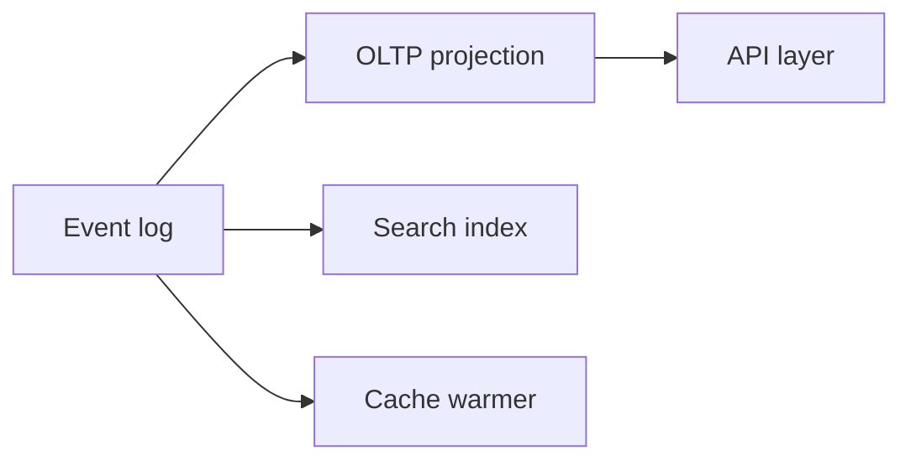

# Day 096: Unbundled Data Systems

Chapter 13 | Architecture build

Compose log, storage, indexes, and serving on purpose.

## Summary

Unbundling replaces one monolithic database with specialized components tied together by an immutable log. Each piece. OLTP store, search index, cache, can be swapped if the log remains the integration backbone.

> These notes and diagrams are original study aids for this repo, not copies of DDIA figures or prose. Read the matching section in your own copy of the book.

## Key points

- The log is the system of integration and replay source.
- Serving stores are disposable caches of derived state.
- Ownership boundaries clarify who rebuilds what after failure.
- Operational surface area grows with component count.

## Diagram

Specialized stores rebuild from the shared log rather than coupling schemas.



## Today

1. Read the matching DDIA section in your own copy of the book.
2. Skim [WORKFLOW.md](../WORKFLOW.md) if you need the shared checklist.
3. Run the starter, then do Try this / Break it / Measure.

### Run the starter

```bash
cd workbook/starter
python3 main.py --help
python3 main.py
```

See [workbook/starter/README.md](./workbook/starter/README.md).

### Try this

Sketch (or stub) an unbundled stack: event log -> derived DB -> search index -> API. Show what each owns.

### Break it

Replace the search index implementation. What stays stable (the log)?

### Measure

Ownership diagram and rebuild instructions for each derived piece.

## Done when

- [ ] You can explain the idea simply
- [ ] You ran the starter and captured output
- [ ] You changed one variable or failure mode and noted what happened
- [ ] You wrote one trade-off you would defend in a design review

Workbook: [workbook/exercise.md](./workbook/exercise.md)
