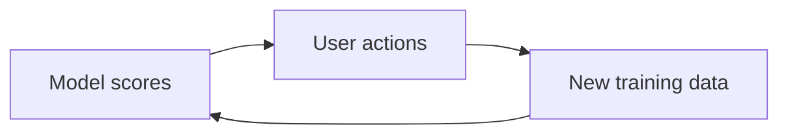

# Day 097: Data and Feedback Loops

Chapter 14 | System analysis

Map how a data product changes behavior, and feeds back into the data.

## Summary

Ranking, recommendations, and fraud models influence user behavior, which generates new training data that reinforces earlier patterns. Feedback loops can amplify bias or blind spots unless you measure outcomes independent of the model's own scores.

> These notes and diagrams are original study aids for this repo, not copies of DDIA figures or prose. Read the matching section in your own copy of the book.

## Key points

- Model output shapes clicks, which become future labels.
- Popularity bias concentrates exposure on already-winning items.
- Holdouts and randomized exploration break self-fulfilling cycles.
- Monitor counterfactual and downstream metrics, not only click-through.

## Diagram

Data products can circularly reinforce the patterns they surface.



## Today

1. Read the matching DDIA section in your own copy of the book.
2. Skim [WORKFLOW.md](../WORKFLOW.md) if you need the shared checklist.
3. Run the starter, then do Try this / Break it / Measure.

### Run the starter

```bash
cd workbook/starter
python3 main.py --help
python3 main.py
```

See [workbook/starter/README.md](./workbook/starter/README.md).

### Try this

Pick rankings, recommendations, or fraud scores. Diagram: model -> user behavior -> new data -> model.

### Break it

Assume the model amplifies a bias. What measurement would catch it?

### Measure

Feedback loop diagram + one mitigation.

## Done when

- [ ] You can explain the idea simply
- [ ] You ran the starter and captured output
- [ ] You changed one variable or failure mode and noted what happened
- [ ] You wrote one trade-off you would defend in a design review

Workbook: [workbook/exercise.md](./workbook/exercise.md)
