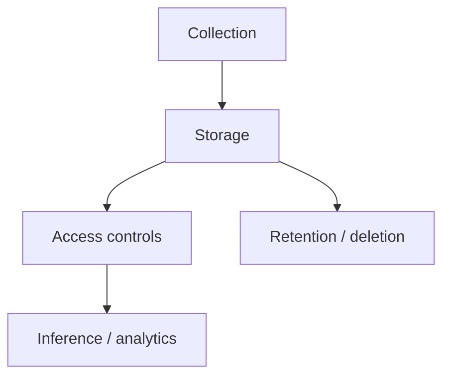

# Day 098: Privacy and Responsibility

Chapter 14 | Privacy review

Threat-model collection, inference, access, and retention.

## Summary

Responsible data systems document what is collected, who can access it, how long it is kept, and what can be inferred. Legal process and insider threats are design inputs: minimize retention, segregate roles, and avoid collecting what you cannot protect.

> These notes and diagrams are original study aids for this repo, not copies of DDIA figures or prose. Read the matching section in your own copy of the book.

## Key points

- Data inventory lists fields, purpose, and lawful basis.
- Retention limits reduce subpoena and breach blast radius.
- Role-based access and audit logs constrain insiders.
- Inference risks exist even when raw secrets are absent.

## Diagram

Privacy review spans collection through retention and access.



## Today

1. Read the matching DDIA section in your own copy of the book.
2. Skim [WORKFLOW.md](../WORKFLOW.md) if you need the shared checklist.
3. Run the starter, then do Try this / Break it / Measure.

### Run the starter

```bash
cd workbook/starter
python3 main.py --help
python3 main.py
```

See [workbook/starter/README.md](./workbook/starter/README.md).

### Try this

For a feature that stores user data: list what you collect, who can access it, retention, and sensitive inferences.

### Break it

A subpoena or insider access scenario. What can they get? What should have been deleted?

### Measure

Data inventory + retention policy draft.

## Done when

- [ ] You can explain the idea simply
- [ ] You ran the starter and captured output
- [ ] You changed one variable or failure mode and noted what happened
- [ ] You wrote one trade-off you would defend in a design review

Workbook: [workbook/exercise.md](./workbook/exercise.md)
