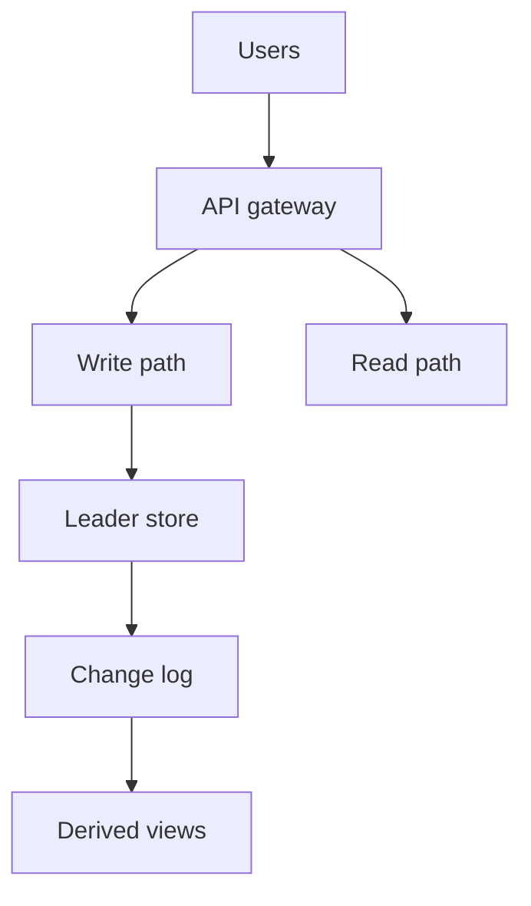

# Day 099: Capstone Architecture

Chapter 14 | Full architecture document

Design a multi-region data-intensive product end to end.

## Summary

The capstone ties together modeling, replication, partitioning, consistency, streams, operations, and privacy in one coherent design. A checklist scorer helps verify you addressed failure modes, not only drew boxes for every trendy database.

> These notes and diagrams are original study aids for this repo, not copies of DDIA figures or prose. Read the matching section in your own copy of the book.

## Key points

- State the product's critical user journeys and their consistency needs.
- Name single points of failure and how you eliminate or accept them.
- Show data flow from write path through derived views.
- Document ops: backups, restores, deploys, and key metrics.

## Diagram

Capstone designs connect user paths to storage, logs, and derived data.



## Today

1. Read the matching DDIA section in your own copy of the book.
2. Skim [WORKFLOW.md](../WORKFLOW.md) if you need the shared checklist.
3. Run the starter, then do Try this / Break it / Measure.

### Run the starter

```bash
cd workbook/starter
python3 main.py --help
python3 main.py
```

See [workbook/starter/README.md](./workbook/starter/README.md).

### Try this

Pick a product (e.g. collaborative notes, ride-sharing, storefront). Cover: data model, storage, replication, sharding, consistency, streams, ops, privacy.

### Break it

Write down top 5 risks and the test you would run for each.

### Measure

Architecture doc with explicit trade-offs, not a tool laundry list.

## Done when

- [ ] You can explain the idea simply
- [ ] You ran the starter and captured output
- [ ] You changed one variable or failure mode and noted what happened
- [ ] You wrote one trade-off you would defend in a design review

Workbook: [workbook/exercise.md](./workbook/exercise.md)
