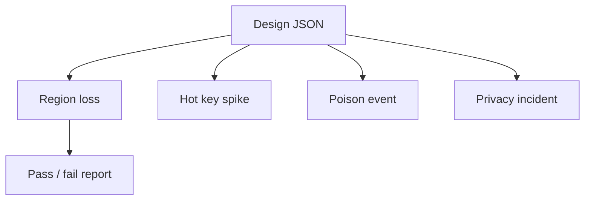

# Day 100: Capstone Defense

Chapter 14 | Final design review

Break your own architecture, revise it, and defend the trade-offs.

## Summary

Adversarial review stress-tests a design against region loss, hot keys, poison events, privacy incidents, and traffic spikes. A scenario runner scores whether your documented mitigations actually address each failure mode.

> These notes and diagrams are original study aids for this repo, not copies of DDIA figures or prose. Read the matching section in your own copy of the book.

## Key points

- Region loss requires explicit RPO/RTO and failover drills.
- Hot keys need detection, caching, or salting, not hope.
- Poison events belong in validation, quarantine, and DLQ paths.
- Post-incident revisions should update the decision log with evidence.

## Diagram

Defense runs scripted adversarial scenarios against your architecture.



## Today

1. Read the matching DDIA section in your own copy of the book.
2. Skim [WORKFLOW.md](../WORKFLOW.md) if you need the shared checklist.
3. Run the starter, then do Try this / Break it / Measure.

### Run the starter

```bash
cd workbook/starter
python3 main.py --help
python3 main.py
```

See [workbook/starter/README.md](./workbook/starter/README.md).

### Try this

Attack day 99's design: region loss, hot key, poison event, privacy incident, thundering herd. Revise where needed.

### Break it

Have a friend (or rubber duck) argue for a radically simpler design. Steal anything that works.

### Measure

Final decision log: what changed after adversarial review, and why.

## Done when

- [ ] You can explain the idea simply
- [ ] You ran the starter and captured output
- [ ] You changed one variable or failure mode and noted what happened
- [ ] You wrote one trade-off you would defend in a design review

Workbook: [workbook/exercise.md](./workbook/exercise.md)
